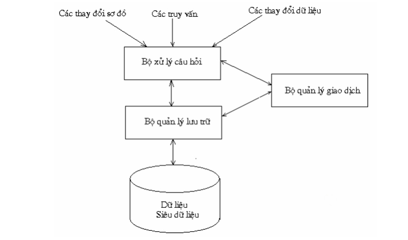
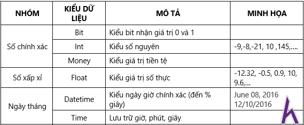
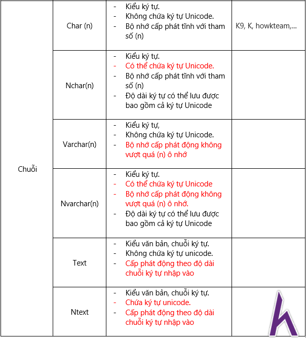

# BUỔI 1: NHẬP MÔN CSDL

- [BUỔI 1: NHẬP MÔN CSDL](#buổi-1-nhập-môn-csdl)
  - [I. CSDL là gì?](#i-csdl-là-gì)
    - [1. Thành phần chính của Database.](#1-thành-phần-chính-của-database)
    - [2. Vai trò của Database.](#2-vai-trò-của-database)
  - [II. Hệ quản trị CDSL là gì?](#ii-hệ-quản-trị-cdsl-là-gì)
    - [1. Cấu trúc của hệ quản trị CDSL.](#1-cấu-trúc-của-hệ-quản-trị-cdsl)
    - [2. Phân loại hệ quản trị CSDL.](#2-phân-loại-hệ-quản-trị-csdl)
      - [Theo mô hình dữ liệu](#theo-mô-hình-dữ-liệu)
      - [Theo cách lưu trữ](#theo-cách-lưu-trữ)
      - [Theo mức độ phân tán](#theo-mức-độ-phân-tán)
    - [3. Các chức năng chính của hệ quản trị CSDL.](#3-các-chức-năng-chính-của-hệ-quản-trị-csdl)
  - [III. Câu lệnh tạo database, table trong MS SQL Server.](#iii-câu-lệnh-tạo-database-table-trong-ms-sql-server)
    - [1. Câu lệnh tạo database.](#1-câu-lệnh-tạo-database)
    - [2. Câu lệnh tạo table.](#2-câu-lệnh-tạo-table)
      - [Các kiểu dữ liệu trong SQL Server](#các-kiểu-dữ-liệu-trong-sql-server)


## I. CSDL là gì?

- Cơ sở dữ liệu (Database) là một tập hợp có tổ chức các thông tin hoặc dữ liệu có cấu trúc, thường được lưu trữ và dễ dàng truy cập qua hệ thống máy tính. Dữ liệu trong các cơ sở dữ liệu hiện nay thường được mô hình hóa theo dạng bảng gồm các hàng và cột. Một số ví dụ về database có thể bắt gặp trong cuộc sống hàng ngày chính là: danh sách nhân viên, bảng kiểm kê hàng hóa, bảng chấm công…

- Cơ sở dữ liệu được kiểm soát bởi hệ thống quản lý cơ sở dữ liệu (Database management system – DBMS). DBMS được thiết kế với chức năng là truy xuất, thao tác và quản lý dữ liệu trong database. Người dùng có thể sử dụng ngôn ngữ truy vấn (query language – SQL) để đưa ra các yêu cầu truy cập, sửa đổi, cập nhật hay kiểm soát dễ dàng những dữ liệu từ các DBMS.

- Cơ sở dữ liệu hiện nay đóng vai trò rất quan trọng đối với người phân tích dữ liệu khi làm việc. Database sẽ giúp người dùng truy cập nhanh chóng hệ thống cơ sở dữ liệu và kết nối các dữ liệu dễ dàng. Nhờ có cơ sở dữ liệu mà người dùng có thể truy xuất những dữ liệu và thông tin hữu ích cho công việc.

### 1. Thành phần chính của Database.

**Một database hoàn chỉnh bao gồm 5 thành phần chính:** 

- **Phần cứng:** Phần cứng bao gồm các thiết bị điện tử vật lý như máy tính, thẻ nhớ, đĩa cứng, thiết bị I/O,… Chúng được dùng để tăng sự tương tác của con người với hệ thống dữ liệu. 

- **Phần mềm:** Phần mềm là các chương trình giúp quản lý và kiểm soát cơ sở dữ liệu. Chúng bao gồm: phần mềm cơ sở dữ liệu, hệ điều hành, phần mềm mạng lưới được sử dụng để chia sẻ dữ liệu với những người dùng khác. 

- **Dữ liệu:** Dữ liệu là những sự kiện và thông tin thô từ nhiều nguồn khác nhau được lưu trữ trong Database, dữ liệu này cần được tổ chức và xử lý để làm cho nó có ý nghĩa hơn. 

- **Quy trình:** Cơ sở dữ liệu được nhiều người khác nhau sử dụng, do đó mà sẽ cần có quy trình cụ thể. Quy trình chính là tập hợp những hướng dẫn về cách database hoạt động. Điều này sẽ giúp người dùng dễ hiểu, dễ quản lý và sử dụng hơn.

- **Ngôn ngữ truy cập cơ sở dữ liệu:** Ngôn ngữ truy cập cơ sở dữ liệu là ngôn ngữ dùng để viết lệnh truy xuất, cập nhật và xóa dữ liệu được lưu trữ trong cơ sở dữ liệu. Có thể hiểu đơn giản đây là ngôn ngữ để người dùng giao tiếp với database. Hiện nay, SQL là ngôn ngữ phổ biến nhất.

### 2. Vai trò của Database.

**Database có vai trò quan trọng trong việc quản lý và lưu trữ thông tin dữ liệu của một tổ chức hoặc một hệ thống. Dưới đây là một số vai trò quan trọng của database:**

- **Lưu trữ thông tin:** Database cung cấp cho người dùng khả năng lưu trữ và quản lý dữ liệu. Với database, các thông tin dữ liệu của một tổ chức có thể được lưu trữ và theo dõi một cách hiệu quả.

- **Truy xuất dữ liệu:** Database cho phép người dùng truy xuất dữ liệu theo nhiều cách khác nhau. Các truy vấn có thể được tạo ra để lấy ra thông tin cần thiết từ cơ sở dữ liệu, giúp cho người dùng dễ dàng tìm kiếm và sử dụng thông tin một cách nhanh chóng và hiệu quả.

- **Cập nhật dữ liệu:** Database cho phép người dùng thực hiện các thao tác cập nhật dữ liệu. Các thao tác này có thể bao gồm thêm mới, sửa đổi hoặc xóa bỏ thông tin dữ liệu.

- **Bảo mật dữ liệu:** Database có thể được cấu hình để đảm bảo rằng dữ liệu được bảo mật và chỉ có những người được phép truy cập mới có thể truy xuất thông tin dữ liệu.

- **Tích hợp dữ liệu:** Database cho phép tích hợp các thông tin dữ liệu từ nhiều nguồn khác nhau. Các hệ thống khác nhau có thể được kết nối với database để trao đổi thông tin dữ liệu.

**_Tóm lại, database đóng vai trò quan trọng trong việc quản lý và lưu trữ thông tin dữ liệu của một tổ chức hoặc một hệ thống, giúp cho việc quản lý dữ liệu trở nên hiệu quả và dễ dàng hơn._**

## II. Hệ quản trị CDSL là gì?

- Hệ quản trị cơ sở dữ liệu (Database Management System - DBMS) là một hệ thống phần mềm giúp quản lý, lưu trữ, truy xuất và chỉnh sửa các dữ liệu một cách có tổ chức và hiệu quả. DBMS là “cầu nối" giữa cơ sở dữ liệu và người dùng hoặc các ứng dụng để thực hiện các hoạt động tạo, truy vấn, sửa đổi và xóa dữ liệu.

- Hay hiểu đơn giản, hệ quản trị cơ sở dữ liệu là hệ thống tự động hỗ trợ người dùng kiểm soát các thông tin, tạo dựng, cập nhật và duy trì các cơ sở dữ liệu.

### 1. Cấu trúc của hệ quản trị CDSL.



- **Các thao tác với hệ quản trị CSDL**

  - Truy vấn: Là những câu hỏi, yêu cầu về dữ liệu có trong DBMS. Người dùng có thể truy vấn dữ liệu bằng giao diện truy vấn hoặc qua chương trình ứng dụng. Ví dụ: Google như một DBMS khổng lồ, người dùng tìm kiếm trực tiếp thông tin trên Google hoặc các website thuộc Google.

  - Thay đổi sơ đồ dữ liệu: Quản trị viên có thể thay đổi cấu trúc cơ sở dữ liệu, tạo mới hoặc chỉnh sửa bảng, cột, thuộc tính,… để đáp ứng nhu cầu sử dụng.

  - Cập nhật dữ liệu: Bao gồm các thao tác thêm, sửa, xóa dữ liệu trong cơ sở dữ liệu.

- **Bộ xử lý câu hỏi**

  - Tìm kiếm dữ liệu trả lời cho một yêu cầu truy vấn.

  - Biến đổi truy vấn ở mức cao thành các yêu cầu có thể hiểu được bởi hệ CSDL.

  - Lựa chọn một kế hoạch tốt nhất để trả lời truy vấn này.

- **Bộ Quản lý lưu trữ**

  - Lưu trữ và truy xuất dữ liệu trên các thiết bị nhớ.

  - Tổ chức tối ưu dữ liệu trên thiết bị nhớ.

  - Tương tác hiệu quả với bộ quản lý tệp.

- **Bộ Quản lý giao dịch**

  - Định nghĩa giao dịch: một tập các thao tác được xử lý như một đơn vị không chia cắt được.

  - Đảm bảo tính đúng đắn và tính nhất quán của dữ liệu.

  - Quản lý điều khiển tương tranh.

  - Phát hiện lỗi và phục hồi CSDL.

- **Dữ liệu, siêu dữ liệu:** Chúng bao gồm dữ liệu lưu trữ trong CSDL và siêu dữ liệu nằm trong thông tin cấu trúc của cơ sở dữ liệu.

### 2. Phân loại hệ quản trị CSDL.

#### Theo mô hình dữ liệu

- **Hệ quản trị cơ sở dữ liệu quan hệ:** Đây là hệ quản trị cơ sở dữ liệu phổ biến nhất. Các dữ liệu được tổ chức dưới dạng bảng có hàng, cột ràng buộc để lưu trữ và quản lý dữ liệu.

- **Hệ quản trị cơ sở dữ liệu phi quan hệ:** Các dữ liệu được tổ chức không theo mô hình quan hệ, thường dùng để quản lý, lưu trữ dữ liệu phi cấu trúc như văn bản, video, hình ảnh.

#### Theo cách lưu trữ

- **Lưu trữ trên bộ nhớ:** Lưu trữ dữ liệu trong bộ nhớ RAM để cung cấp tốc độ truy xuất nhanh.

- **Lưu trữ trên đĩa cứng:** Các dữ liệu được lưu trữ trên đĩa cứng.

#### Theo mức độ phân tán

- **Hệ quản trị cơ sở dữ liệu cục bộ:** Dữ liệu được lưu trữ trên máy tính cục bộ, được sử dụng cho các ứng dụng nhỏ và có quy mô vừa phải.

- **Hệ quản trị cơ sở dữ liệu phân tán:** Là loại hệ quản trị cơ sở dữ liệu lưu trữ dữ liệu trên nhiều máy tính, được sử dụng cho các ứng dụng có quy mô lớn và có yêu cầu khả năng mở rộng cao.

### 3. Các chức năng chính của hệ quản trị CSDL.

**Hệ quản trị cơ sở dữ liệu cung cấp nhiều chức năng quan trọng, bao gồm:**

- **Tạo và quản lý cơ sở dữ liệu:** Hệ quản trị cơ sở dữ liệu giúp người dùng tạo lập cơ sở dữ liệu, cấu trúc của cơ sở dữ liệu, thêm, sửa và xóa dữ liệu trong cơ sở dữ liệu.

- **Truy vấn dữ liệu:** DBMS cung cấp các công cụ để người dùng truy vấn dữ liệu trong cơ sở dữ liệu, chẳng hạn như ngôn ngữ truy vấn SQL.

- **Bảo mật dữ liệu:** Hệ quản trị cơ sở dữ liệu có chức năng giúp bảo vệ dữ liệu khỏi các truy cập trái phép, chẳng hạn như sử dụng các cơ chế xác thực và cấp phép.

- **Sao lưu, khôi phục dữ liệu:** Chức năng của DBMS là giúp khôi phục, sao lưu dữ liệu trong trường hợp dữ liệu bị mất hoặc bị hỏng.

## III. Câu lệnh tạo database, table trong MS SQL Server.

### 1. Câu lệnh tạo database.

`CREATE DATABASE <tên database>`

**Ví dụ:** `CREATE DATABASE SQLDBQuery`

**_Lưu ý:_**

- Mỗi Database chỉ tồn tại với một TÊN DUY NHẤT, không trùng lặp với tên các Database sẳn có.

- Chữ viết hoa hay thường không gây ảnh hưởng đến cú pháp trong SQL.

### 2. Câu lệnh tạo table.

```
CREATE TABLE Tên_bảng
(
    Tên_cột_1 Kiểu_dữ_liệu,
    Tên_cột_2 Kiểu_dữ_liệu,
    ...
    Tên_cột_n Kiểu_dữ_liệu
)
```

**Ví dụ:** 

```
CREATE TABLE SINHVIEN
(
    MASV CHAR(10),
    TENSV TEXT,
    GIOITINHSV BIT
)
```

#### Các kiểu dữ liệu trong SQL Server



