# BUỔI 2: CƠ BẢN VỀ THIẾT KẾ CSDL

## I. Lý thuyết về thiết kế  CSDL.

### 1. Khái niệm của thiết kế CSDL.

Thiết kế cơ sở dữ liệu là quá trình chọn lọc, phân nhóm và tổ chức dữ liệu trên hệ thống. Công việc chính của quá trình này là chọn lọc dữ liệu nào sẽ được lưu trữ và quyết định tính tương quan giữa chúng. Nhờ thiết kế CSDL, hệ thống sẽ dễ dàng đọc, hiểu, quản lý, truy xuất thông tin thông suốt và tiết kiệm chi phí lưu trữ.

### 2. Lợi ích của thiết kế CSDL.

Quá trình thực hiện thiết kế CSDL khiến dữ liệu được sắp xếp gọn gàng, đưa những thông tin hữu ích ẩn xuất hiện. Ngoài ra, nếu dữ liệu được thiết kế chặt chẽ, chực quan, nó còn mang đến những lợi ích:

- **Tiết kiệm thời gian và nguồn lực khi cần tra cứu hoặc trích xuất dữ liệu.**

- **Hệ thống dễ bảo trì, cập nhật**: Mỗi nhóm dữ liệu đều có vị trí cố định và liên kết chặt chẽ với nhau. Thế nên khi có thêm dữ liệu mới hoặc sửa lỗi, các nhóm trong chuỗi liên kết cũng tự động cập nhật sửa đổi theo.

- **Các bên liên quan có thể hiểu, vận dụng tốt dữ liệu**: Database Design đủ tốt sẽ làm cho cả những người không có chuyên môn hiểu được ý nghĩa của dữ liệu và ứng dụng vào nhiều công việc khác nhau.

### 3. Thiết kế CSDL tốt.

Một số nguyên tắc hướng dẫn quy trình thiết kế cơ sở dữ liệu. Nguyên tắc đầu tiên: thông tin trùng lặp (hay còn gọi là dữ liệu dự phòng) là có hại vì thông tin này gây lãng phí về dung lượng và làm tăng khả năng lỗi cũng như sự không nhất quán. Nguyên tắc thứ hai là sự chính xác và sự hoàn chỉnh của thông tin rất quan trọng. Nếu cơ sở dữ liệu có chứa thông tin không chính xác thì mọi báo cáo sử dụng thông tin từ cơ sở dữ liệu đó cũng sẽ chứa thông tin không chính xác. Kết quả là mọi quyết định được đưa ra dựa trên các báo cáo đó sẽ trở thành thông tin sai lệch.

Để đảm bảo tính hiệu quả và thỏa mãn 2 nguyên tắc trên, khi thực hiện Database design cần:

- **Dựa vào đặc điểm để chia thành các bảng.**

- **Cung cấp đầy đủ các dữ kiện về tính liên kết của dữ liệu**: Database design cần phải có thông tin về đặc điểm, điểm tương đồng, mối quan hệ trong cùng một nhóm và giữa các nhóm dữ liệu.

- **Rà soát tính chính xác và độ tin cậy của dữ liệu**: Dữ liệu được chọn phải là dữ liệu đến từ thực tế hoặc từ nguồn đáng tin. Nếu không, kết quả trả ra sẽ trở nên vô nghĩa.

### 4. Các bước thực hiện thiết kế CSDL.

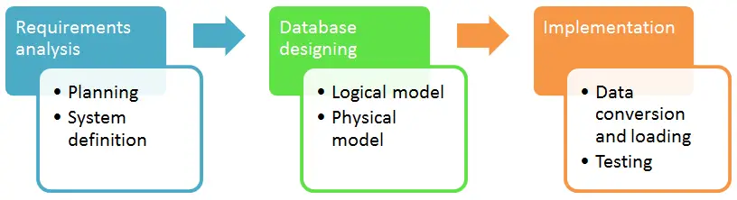

**Bước 1: Phân tích yêu cầu.**

Trong Database design chia ra 2 nhóm đối tượng là: người thực hiện (database designer) và người sử dụng (database users). Database designer phải tổng hợp và lập kế hoạch triển khai sao cho đáp ứng được tất cả mong đợi, yêu cầu và mục đích sử dụng của database users. Kế hoạch này phải thể hiện được rõ ràng các bước tổng hợp, chọn lọc các cấu trúc dữ liệu và kết quả trả ra.

Sau đó, database designer cần xác nhận và thống nhất với database users về kế hoạch trên. Ở bước này, phạm vi triển khai, giới hạn, thông số kỹ thuật và những lưu ý cần được làm rõ, việc này sẽ giúp database users không mong đợi vượt quá khả năng và giúp database designer trả ra kết quả thỏa đáng.

**Bước 2 : Thiết kế cơ sở dữ liệu.**

Đây được xem là bước quan trọng nhất trong quá trình này. Mục tiêu chính của bước này là tạo ra thiết kế logic của dữ liệu (Logical design) và thiết kế vật lý của dữ liệu (physical design) theo mô hình CSDL. Thiết kế logic là cách các dữ liệu kết nối với nhau, có thể hiểu là sơ đồ vận hành của các nhóm dữ liệu. Còn thiết kế vật lý là cách các dữ liệu được lưu trữ cụ thể ở phần cứng nào và các chi tiết của dữ liệu được sắp đặt ra sao.

**Bước 3: Triển khai.**

Ở bước này thì dữ liệu chính thức được chuyển đổi từ hệ thống cũ sang CSDL mới theo định hướng của logical design và physical design. Lúc này, các database designer sẽ giám sát dữ liệu tuần tự được trả về các nhóm, đảm bảo tính kết nối theo sơ đồ đã vạch ra. Các lỗi sẽ được xác định, điều chỉnh và đảm bảo các thông số có đủ.

## II. Lược đồ quan hệ E-R.

Mô hình quan hệ thực thể (Entity Relationship model - E-R) được CHEN giới thiệu vào năm 1976 là một mô hình được sử dụng rộng rãi trong các bản thiết kế cơ sở dữ liệu ở mức khái niệm, được xây dựng dựa trên việc nhận thức thế giới thực thông qua tập các đối tượng được gọi là các thực thể và các mối quan hệ giữa các đối tượng này.

**Thực thể (Enity)** là một vật thể tồn tại và phân biệt được với các vật thể khác. VD: mỗi học sinh là một thực thể, mỗi môn học là một thực thể, ...

Một nhóm bao gồm các thực thể tương tự nhau gọi là một **tập thực thể**.

Để xác định một tập thực thể cần phải thiết lập một số hữu hạn các tính chất đặc trưng của tất cả các thực thể trong tập thực thể đó, gọi là các **thuộc tính**. 

**Quan hệ** là sự liên kết giữa hai hay nhiều tập thực thể. Tập quan hệ là tập hợp các mối quan hệ giống nhau.

Việc lựa chọn các tập thực thể là bước quan trọng trong quá trình xây dựng sơ đồ về mối quan hệ thực thể phản ánh thông tin quản lý cho một thế giới thực nào đó.

### Lược đồ E-R

Là đồ thị biểu diễn các tập thực thể, thuộc tính và mối quan hệ

Các ký hiệu trong lược đồ E-R

- Đỉnh:

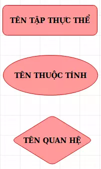

- Cung: là đường nối giữa tập thực thể và thuộc tính, mối quan hệ và tập thực thể.

- Ví dụ:

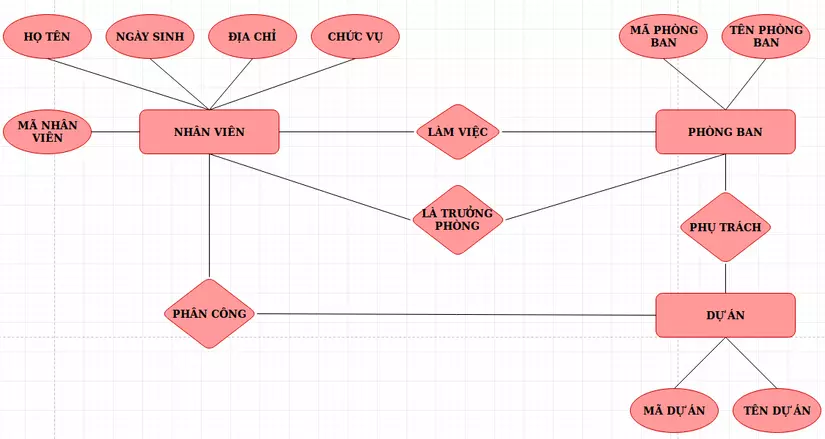

### Các kiểu liên kết trong lược đồ E-R.

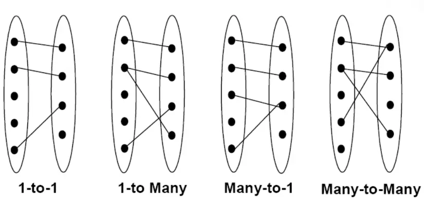

- Ví dụ: Một phòng ban có nhiều nhân viên:

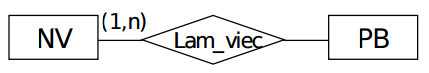

Một loại thực thể có thể tham gia nhiều lần vào một quan hệ với nhiều vai trò khác nhau.

### Thuộc tính khóa.

Mỗi tập thực thể phải có 1 khóa.

Một khóa có thể có 1 hay nhiều thuộc tính.

Có thể có nhiều khóa trong 1 tập thực thể, ta sẽ chọn ra 1 khóa làm khóa chính cho tập thực thể đó.

## III. Mô hình dữ liệu quan hệ.

Mô hình Dữ liệu Quan hệ (Relational Data Model – RDM) lần đầu tiên được Ted Codd của IBM phát triển vào những năm 1970. Sau đó khoảng 10 năm, RDM chính thức được đưa vào triển khai thương mại nhằm mục đích lưu trữ và xử lý dữ liệu trong cơ sở dữ liệu. Sở dĩ RDM trở nên phổ biến như vậy chính bởi tính đơn giản trong sử dụng cơ sở dữ liệu, cũng như nền tảng hỗ trợ tốt cho các nhà phát triển.

Trong mô hình dữ liệu quan hệ, không có các liên kết vật lý. Dữ liệu được biểu diễn dưới dạng bảng với các hàng và các cột: CSDL là tập hợp các bảng (còn gọi là quan hệ). Mỗi hàng là một bản ghi (record), còn được gọi là bộ (tuple). Mỗi cột là một thuộc tính, còn được gọi là trường (field).

Dựa trên lý thuyết toán học, đồng thời cũng gần với cấu trúc tệp và cấu trúc dữ liệu nên có hai loại thuật ngữ liên quan:

- Thuật ngữ toán học: quan hệ, bộ, thuộc tính.

- Thuật ngữ hướng dữ liệu: bảng, bản ghi, trường.

### 1. Khái niệm.

Mô hình dữ liệu quan hệ là mô hình thể hiện mối quan hệ về mặt dữ liệu trong một đối tượng hoặc giữa các đối tượng với nhau.

Sử dụng các phép toán như hợp, giao, tích đề các, chia, trừ, chiếu, chọn, kết nối,..để xây dựng mô hình.

Mô hình dữ liệu quan hệ bao gồm một hoặc nhiều quan hệ (Relation). 

### 2. Quy ước ký hiệu.

**Quan hệ:** dùng các ký tự in hoa Q, R, S.

**Quan hệ Q có tập thuộc tính {A1,A2,..,An}:** Q(A1,A2,..,An).

### 3. Khái niệm khóa trên các hệ quản trị CSDL.

#### Khoá chính (Primary Key)

- X được gọi là khoá chính của quan hệ Q nếu giá trị trên X phân biệt giữa các bộ. 

- Mỗi quan hệ chỉ được khai báo một khoá chính.

- Khóa chính được ký hiệu là dấu #.

#### Khoá ngoại (Foreign Key)

- Cho 2 quan hệ Q và R. X được gọi là khoá ngoại của R nếu X là thuộc tính của R và X là khoá chính của Q. 

- Tên thuộc tính trên khóa ngoại và khóa chính có thể khác nhau.

- Khóa chính được ký hiệu là dấu @.

**Nhận xét:** 
> - Ưu điểm: 
>
>   - Dựa trên lý thuyết tập hợp.
>
>   - Khả năng tối ưu hóa các xử lý phong phú.
>
> - Nhược điểm:
>
>   - Hạn chế trong biểu diễn ngữ nghĩa.
>
>   - Cấu trúc dữ liệu không linh hoạt.

## IV. Chuẩn hóa dữ liệu: 1NF, 2NF, 3NF.

### 1. Chuẩn hóa dữ liệu là gì?

Chuẩn hóa dữ liệu là quá trình biểu diễn cơ sở dữ liệu dưới dạng chuẩn. Đây là một kỹ thuật thiết kế bảng trong cơ sở dữ liệu, chia các bảng lớn thành các bảng nhỏ hơn và liên kết chúng bằng các mối quan hệ. 

Quá trình này diễn ra với mục đích là loại bỏ hoặc làm giảm sự dư thừa và phụ thuộc của dữ liệu. Nhưng chuẩn hóa làm tăng thời gian truy vấn.

### 2. Các dạng chuẩn hóa.

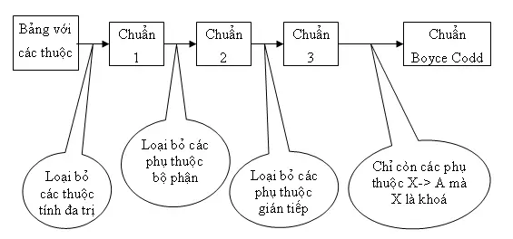

### 1NF (First Normal Form)

Một bảng (quan hệ) được gọi là ở dạng chuẩn 1NF nếu và chỉ nếu toàn bộ các miền giá trị của các cột có mặt trong bảng (quan hệ) đều chỉ chứa các giá trị nguyên tử (không thể phân tách).

- **Ví dụ:**

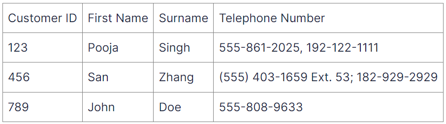

Bảng này đang vi phạm 1NF vì cột Telephone Number chứa nhiều giá trị (nhiều số điện thoại) nên các giá trị trong cột không phải là nguyên tố mà có thể được chia thành hai số. 

Chỉnh sửa để đưa về dạng 1NF:

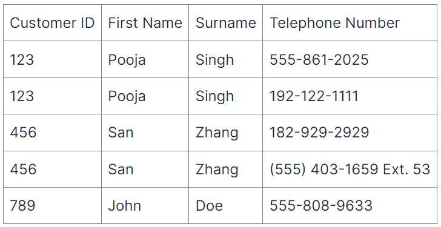

### 2NF (Second Normal Form)

Dạng chuẩn hóa thứ hai xây dựng trên cơ sở của 1NF bằng cách loại bỏ các phụ thuộc một phần. Phụ thuộc một phần xảy ra khi một thuộc tính phụ thuộc vào chỉ một phần của khóa chính.  

Để đạt được 2NF, bảng nên được chia thành các bảng riêng biệt, trong đó mỗi thuộc tính phụ thuộc hoàn toàn vào toàn bộ khóa chính.  

- **Ví dụ:**

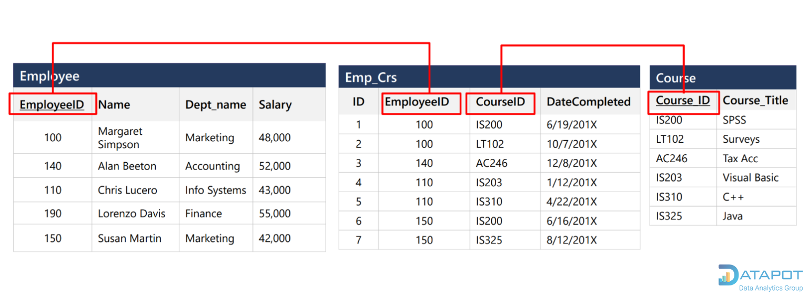

Trong bảng Employee, các cột Name (Tên nhân sự), Dept_name (Tên phòng ban), Salary (Mức lương) phụ thuộc vào cột EmployeeID (Mã nhân sự). 

Trong bảng Emp_Crs, các cột EmployeeID (Mã nhân sự), CourseID (Mã khóa học) và DateCompleted (Ngày hoàn thành khóa học) phụ thuộc vào cột ID. 

Trong bảng Course (Khóa học), cột Course_Title (Tên khóa học) phụ thuộc vào cột Course_ID (Mã khóa học). 

### 3NF (Third Normal Form)

Dạng chuẩn hóa thứ ba tiếp tục cải thiện cấu trúc bảng bằng cách loại bỏ các phụ thuộc chuyển tiếp. Phụ thuộc chuyển tiếp xảy ra khi một thuộc tính phụ thuộc vào một thuộc tính khác không phải là khóa chính. 

Trong 3NF, các bảng được chia để loại bỏ các phụ thuộc này.  

- **Ví dụ:**

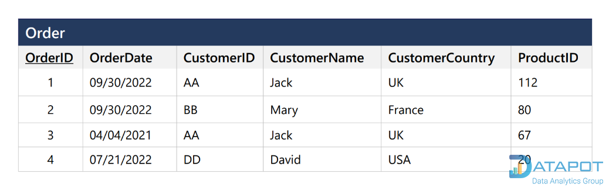

Bảng thông tin đơn hàng trên chưa được chuẩn hóa 3NF, ta thấy có cột OrderID (Mã đơn hàng) là khóa chính nhưng các cột CustomerName (Tên khách hàng), CustomerCountry (Quốc gia của khách hàng) vẫn phụ thuộc vào cột khóa ngoại là CustomerID (Mã khách hàng). 

Để chuẩn hóa 3NF, ta tách các cột chứa thông tin về khách hàng thành một bảng khác như sau: 

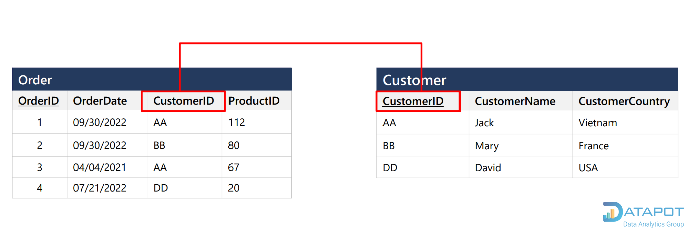