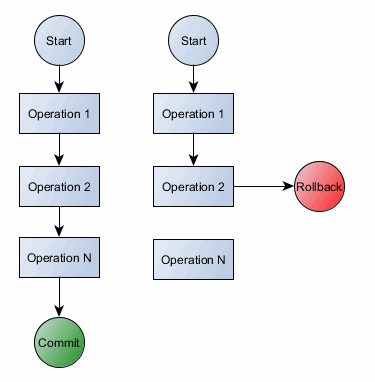

# BUỔI 4: SQL NÂNG CAO

- [BUỔI 4: SQL NÂNG CAO](#buổi-4-sql-nâng-cao)
  - [I. Index.](#i-index)
    - [1. Index là gì?](#1-index-là-gì)
    - [2. Khi nào sử dụng index?](#2-khi-nào-sử-dụng-index)
    - [3. Ưu - nhược điểm khi sử dụng index.](#3-ưu---nhược-điểm-khi-sử-dụng-index)
      - [Ưu điểm:](#ưu-điểm)
      - [Nhược điểm:](#nhược-điểm)
    - [4. Cấu trúc của index.](#4-cấu-trúc-của-index)
    - [5. Lệnh CREATE INDEX](#5-lệnh-create-index)
      - [Chỉ mục SINGLE-COLUMN](#chỉ-mục-single-column)
      - [Chỉ mục UNIQUE](#chỉ-mục-unique)
      - [Chỉ mục COMPOSITE](#chỉ-mục-composite)
      - [IMPLICIT INDEX](#implicit-index)
  - [II. Transaction.](#ii-transaction)
    - [1. Đặc điểm của Transaction.](#1-đặc-điểm-của-transaction)
    - [2. Xử lý Transaction.](#2-xử-lý-transaction)
      - [Lệnh COMMIT.](#lệnh-commit)
      - [Lệnh ROLLBACK.](#lệnh-rollback)
      - [Lệnh SAVEPOINT.](#lệnh-savepoint)
      - [Lệnh RELEASE SAVEPOINT.](#lệnh-release-savepoint)
      - [Lệnh SET TRANSACTION](#lệnh-set-transaction)

## I. Index.

### 1. Index là gì?

Index (hay chỉ mục) là một cấu trúc dữ liệu để tăng hiệu suất truy vấn của cơ sở dữ liệu. Index cho phép cơ sở dữ liệu thực hiện một số câu truy vấn có điều kiện nhanh hơn so với thông thường. Index trong cơ sở dữ liệu tương tự như một chỉ mục ở mặt sau của một tạp chí. Nhưng index cũng được lưu trên bộ nhớ và tiêu tốn không gian bộ nhớ và thời gian để tạo, cập nhật index nên khi sử dụng index cần phải suy xét kĩ.

Ví dụ: Để tham khảo tất cả các trang trong một cuốn sách đề cập đến một chủ đề cụ thể, trước tiên bạn hãy vào mục lục, liệt kê tất cả các chủ đề theo thứ tự bảng chữ cái, sau đó bạn đi đến một hoặc nhiều số trang cụ thể.

### 2. Khi nào sử dụng index?

Index giúp tăng tốc độ truy vấn của một số câu lệnh select có điều kiện vì vậy nó đặc biệt hữu dụng khi câu lệnh truy vấn được sử dụng thường xuyên (hoặc cột được tạo index thường được truy vấn) và số lượng bản ghi lớn.

Khó để xác định khi nào sử dụng index, nó phụ thuộc nhiều vào các bài toán thực tế tuy nhiên có một số quy luật thường thấy khi chọn một cột (hoặc tập các cột) để tạo index:

- **Khóa và các cột có giá trị độc nhất (unique)**: Database thường sẽ tự động tạo index cho các cột này nên để tranh việc trùng lặp và tiêu tốn bộ nhớ ta không nên tạo thêm index cho chúng.

- **Tần suất được sử dụng**: Khi tần suất sử dụng câu truy vấn càng lớn thì việc tạo index sẽ giúp làm giảm càng nhiều thời gian truy vấn.

- **Số lượng bản ghi của bảng**: Số lượng bản ghi của bảng càng nhiều thì tốc độ truy vấn sẽ càng giảm lợi thế của việc sử dụng index trên các bảng này lại càng rõ ràng so với những bảng có số lượng bản ghi ít. Đặc biệt đối với trường hợp một bảng có ít bản ghi (100 - vài nghìn) ta không nên tạo chỉ mục cho chúng.

- **Dữ liệu của bảng tăng trưởng nhanh**: Index sẽ tự động cập nhật khi có một bản ghi được thêm vào cơ sở dữ liệu, vì vậy khi đánh chỉ mục cho 1 bảng nó sẽ làm chậm lại các hành động thêm sửa xóa bản ghi. Vậy nên một bảng thường xuyên được cập nhật nên có ít index hơn một bảng hiếm khi cập nhật.

- **Không gian bộ nhớ**: Khi tạo index sẽ sử dụng chính không gian bộ nhớ của cơ sở dữ liệu nên khi cơ sở dữ liệu có kích thước lớn ta cần lựa chọn cẩn thận trường nào sẽ sử dụng làm index.

- **Dữ liệu có đa dạng giá trị**: Index được tạo dựa trên các giá trị trong cột mà nó trỏ tới ví dụ như cột index được tạo chỉ có 3 giá trị A, B, C thì index được tạo sẽ có giá trị nhỏ hơn nhiều so với cột có dải giá trị trải dài cả bảng chữ cái. Index trên cột có ít giá trị ví dụ cột sex sẽ không làm tăng nhiều tốc độ truy vấn tuy nhiên đối với những cột có nhiều giá trị riêng biệt như cột name sẽ làm tăng tốc độ truy vấn đáng kể.

### 3. Ưu - nhược điểm khi sử dụng index.

#### Ưu điểm:

- Thường sẽ làm tăng hiệu năng truy vấn khi điều kiện rơi vào các cột được đánh chỉ mục.

- Giúp ta có thể truy vấn dữ liệu nhanh hơn.

- Có thể được sử dụng để sắp xếp dữ liệu.

- Các chỉ mục độc nhất đảm bảo tính duy nhất của trường trong cơ sở dữ liệu

#### Nhược điểm:

- Làm giảm hiệu năng các câu lệnh insert, update ,delete.

- Chiếm dụng bộ nhớ.

### 4. Cấu trúc của index.

Index  gồm:

- Cột Search Key: chứa bản sao các giá trị của cột được tạo Index

- Cột Data Reference: chứa con trỏ trỏ đến địa chỉ của bản ghi có giá trị cột index tương ứng


### 5. Lệnh CREATE INDEX

Cú pháp cơ bản của lệnh CREATE INDEX trong SQL như sau:

```
CREATE INDEX ten_index ON ten_bang;
```

#### Chỉ mục SINGLE-COLUMN

Single-Column Index được tạo cho duy nhất 1 cột trong bảng. Cú pháp cơ bản như sau:

```
CREATE INDEX ten_index
ON ten_bang (ten_cot);
```
#### Chỉ mục UNIQUE

Unique Index là chỉ mục duy nhất, được sử dụng để tăng hiệu suất và đảm bảo tính toàn vẹn dữ liệu. Một chỉ mục duy nhất không cho phép chèn bất kỳ giá trị trùng lặp nào được chèn vào bảng. Cú pháp cơ bản như sau:

```
CREATE UNIQUE INDEX ten_index
ON ten_bang (ten_cot);
```

#### Chỉ mục COMPOSITE

Composite Index là chỉ mục kết hợp dành cho hai hoặc nhiều cột trong một bảng. Cú pháp cơ bản của nó như sau:

```
CREATE INDEX ten_index
ON ten_bang (cot1, cot2);
```

>**_Lưu ý:_**
>
>- Việc tạo Single-Column Index hay Composite Index tùy thuộc vào tần suất bạn sử dụng mệnh đề WHERE của truy vấn dưới dạng điều kiện bộ lọc.
>
>- Nếu chỉ có một cột được sử dụng, thì lựa chọn tốt nhất là Single-column Index. Nếu có hai hoặc nhiều cột được sử dụng thường xuyên trong mệnh đề WHERE như là các bộ lọc thì dạng chỉ mục Composite Index là lựa chọn tối ưu hơn.

#### IMPLICIT INDEX

Implicit Index (Index ngầm định) là chỉ mục mà được tạo tự động bởi Database Server khi một bảng được tạo. Các Index ngầm định được tạo tự động cho các ràng buộc Primary key và các ràng buộc Unique.

## II. Transaction.

TRANSACTION trong SQL là tiến trình thực hiện một nhóm các câu lệnh SQL. Các câu lệnh này được thực thi một cách tuần tự và độc lập. Một Transaction được thực hiện thành công khi tất cả câu lệnh đều thành công, khi đó tất cả các thay đổi dữ liệu được thực hiện trong Transaction được lưu vào cơ sở dữ liệu. Tuy nhiên, nếu chỉ một trong số đó thất bại thì toàn bộ tiến trình sẽ thất bại, đồng nghĩa với việc dữ liệu phải rollback về trạng thái ban đầu (dữ liệu được khôi phục về trạng thái trước khi thực hiện Transaction).



Từ hình trên có thể thấy transaction đầu tiên thành công khi tất cả các hoạt động đọc/ghi đều thành công, trong khi transaction thứ 2 bị rollback vì hoạt đông thứ 2 không thành công.

### 1. Đặc điểm của Transaction.

Transaction có bốn đặc điểm tiêu chuẩn sau:

- **Bảo toàn**: đảm bảo rằng tất cả các câu lệnh trong nhóm lệnh được thực thi thành công. Nếu không, transaction bị hủy bỏ tại thời điểm thất bại và tất cả các thao tác trước đó được khôi phục về trạng thái cũ.

- **Nhất quán**: đảm bảo rằng cơ sở dữ liệu thay đổi chính xác các trạng thái khi một transaction được thực thi thành công.

- **Độc lập**: cho phép các transaction hoạt động độc lập và minh bạch với nhau.

- **Bền bỉ**: đảm bảo rằng kết quả của một transaction được commit vẫn tồn tại trong trường hợp lỗi hệ thống.

### 2. Xử lý Transaction.

Trong SQL, có các lệnh sau được sử dụng để điều khiển Transaction:

- ```COMMIT```: để lưu các thay đổi.

- ```ROLLBACK```: để quay trở lại trạng thái trước khi có thay đổi.

- ```SAVEPOINT```: tạo các điểm (point) bên trong các nhóm Transaction để ROLLBACK, tức là để quay trở lại điểm trạng thái đó.

- ```SET TRANSACTION```: đặt một tên cho một Transaction.

Các lệnh điều khiển Transaction chỉ được sử dụng với các lệnh thao tác dữ liệu như INSERT, UPDATE và DELETE. Tuy nhiên chúng không thể được sử dụng trong lệnh CREATE TABLE hoặc DROP TABLE vì các hoạt động này được tự động xác định trong cơ sở dữ liệu.

#### Lệnh COMMIT.

- Transaction kết thúc với một trong hai câu lệnh COMMIT hoặc ROLLBACK với mục đích khác nhau. COMMIT ý chỉ rằng transaction đã thành công và mọi thay đổi đã được đồng bộ với database. Trong khi ROLLBACK chỉ ra rằng transaction đã gặp lỗi trong quá trình thực thi, tất cả các thay đổi dữ liệu trong transaction sẽ không được đồng bộ xuống database.

- Khi một Transaction hoàn chỉnh được hoàn thành thì lệnh COMMIT phải được gọi ra. Lệnh này sẽ giúp lưu những thay đổi tới cở sở dữ liệu.

- Cú pháp: ```COMMIT;```

#### Lệnh ROLLBACK.

- Lệnh ROLLBACK được sử dụng để hoàn tác các transaction chưa được lưu vào cơ sở dữ liệu. Lệnh này chỉ có thể được sử dụng để hoàn tác các transaction kể từ khi lệnh COMMIT hoặc ROLLBACK cuối cùng được phát hành.

- Cú pháp: ```ROLLBACK;```

#### Lệnh SAVEPOINT.

- SAVEPOINT là một điểm trong một transaction khi bạn có thể cuộn transaction trở lại một điểm nhất định mà không quay trở lại toàn bộ transaction.

- Cú pháp: 

```SAVEPOINT TEN_SAVEPOINT;```

Lệnh này chỉ tạo ra SAVEPOINT trong các câu lệnh Transaction. Sau đó ROLLBACK cần được sử dụng để hoàn tác trở lại một SAVEPOINT như sau:

```ROLLBACK TO TEN_SAVEPOINT;```

#### Lệnh RELEASE SAVEPOINT.

- Lệnh SAVEPOINT RELEASE được sử dụng để loại bỏ một SAVEPOINT mà bạn đã tạo ra. Khi SAVEPOINT bị xóa, bạn không thể sử dụng lệnh ROLLBACK để hoàn tác các Transaction về SAVEPOINT đó nữa.

- Cú pháp: ```RELEASE SAVEPOINT TEN_SAVEPOINT;```

#### Lệnh SET TRANSACTION

- SET TRANSACTION có thể được sử dụng để khởi tạo một Database Transaction. Lệnh này được sử dụng để chỉ định các đặc tính cho Transaction đó. Ví dụ, bạn có thể chỉ định một Transaction chỉ được đọc (read only) hoặc đọc viết (read write).

- Cú pháp: ```SET TRANSACTION [ READ WRITE | READ ONLY ];```