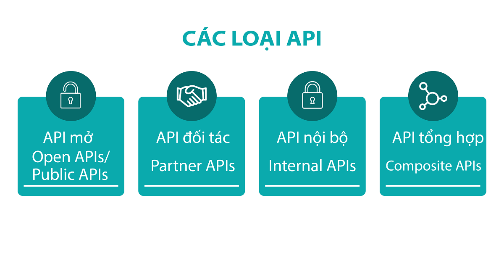
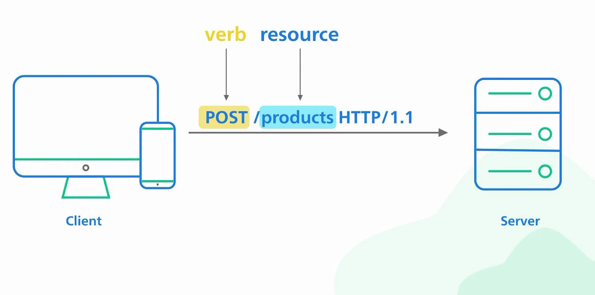
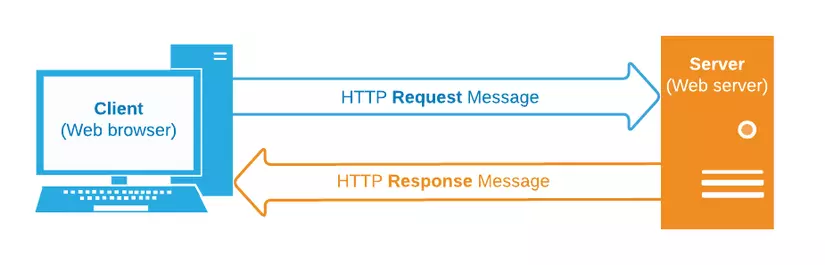
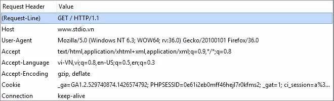
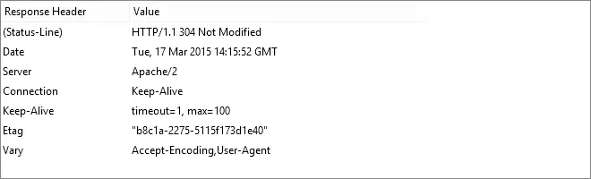
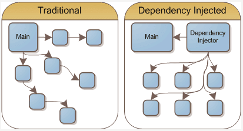
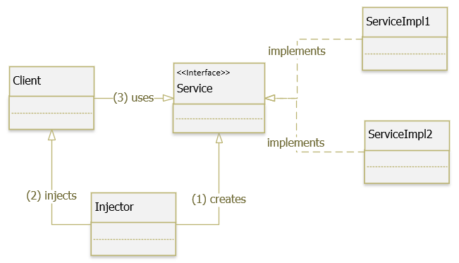

# BUỔI 5: SPRING BOOT CƠ BẢN.

- [BUỔI 5: SPRING BOOT CƠ BẢN.](#buổi-5-spring-boot-cơ-bản)
  - [I. API là gì? RestAPI là gì?](#i-api-là-gì-restapi-là-gì)
    - [1. API là gì?](#1-api-là-gì)
    - [2. Các loại API.](#2-các-loại-api)
    - [3. RestAPI là gì?](#3-restapi-là-gì)
  - [II. HTTP là gì?](#ii-http-là-gì)
  - [III. Các method trong HTTP.](#iii-các-method-trong-http)
    - [1. Các loại request.](#1-các-loại-request)
    - [2. Một số khái niệm khác.](#2-một-số-khái-niệm-khác)
    - [3. GET và POST.](#3-get-và-post)
      - [Một số đặc điểm của phương thức GET:](#một-số-đặc-điểm-của-phương-thức-get)
      - [Một số đặc điểm của phương thức POST:](#một-số-đặc-điểm-của-phương-thức-post)
    - [4. POST/PUSH/PATCH.](#4-postpushpatch)
  - [IV. Response là gì? Request là gì?](#iv-response-là-gì-request-là-gì)
    - [1. Request là gì?](#1-request-là-gì)
    - [2. Response là gì?](#2-response-là-gì)
      - [Một số loại Status-Code thông dụng mà server trả về cho client:](#một-số-loại-status-code-thông-dụng-mà-server-trả-về-cho-client)
  - [V. Design pattern: DI, IOC.](#v-design-pattern-di-ioc)
      - [Dependency Inversion Principle (DIP)](#dependency-inversion-principle-dip)
      - [Sự khác biệt giữa DIP, IoC, DI:](#sự-khác-biệt-giữa-dip-ioc-di)
    - [1. Dependency Injection (DI)](#1-dependency-injection-di)
      - [Các thành phần tham gia Dependency Injection Pattern:](#các-thành-phần-tham-gia-dependency-injection-pattern)
      - [Các dạng Dependency Injection:](#các-dạng-dependency-injection)
    - [2. Inversion of Control (IoC)](#2-inversion-of-control-ioc)
      - [IoC được chia thành 2 loại:](#ioc-được-chia-thành-2-loại)

## I. API là gì? RestAPI là gì?

### 1. API là gì?

API - Application Programming Interface hay Giao diện lập trình ứng dụng, là một tập hợp các định nghĩa và giao thức cho phép các ứng dụng phần mềm giao tiếp và tương tác với nhau. Cũng tương tự như User Interface (Giao diện người dùng) là nơi mà User sẽ tương tác với ứng dụng của chúng ta, khi các phần mềm "nói chuyện" với nhau cũng cần thông qua giao diện đặc biệt có tên gọi là API.


Vai trò của API ngày càng trở nên quan trọng trong việc thúc đẩy sự phát triển của các ứng dụng web và di động. Nhờ API, các nhà phát triển có thể tái sử dụng code, mở rộng tính năng dễ dàng, và kết nối các ứng dụng khác nhau một cách linh hoạt.

**Ví dụ:** Hệ thống phần mềm định vị và chứa dữ liệu về bản đồ trên thế giới của cơ quan có thẩm quyền. Thì ứng dụng maps trên điện thoại của bạn đã giao tiếp với hệ thống này thông qua API để cập nhật dữ liệu và hiển thị những thông tin mới nhất trên điện thoại.

### 2. Các loại API.

API được phân loại theo cả kiến trúc và phạm vi sử dụng. Có 4 loại API:

- **Open APIs hoặc Public APIs (API mở):** Còn có tên gọi khác là API công khai, có sẵn nên có thể được sử dụng bởi bất kỳ nhà phát triển nào. Đổi lại, các Open APIs thông thường sẽ yêu cầu các biện pháp xác thực hoặc ủy quyền thấp và bị hạn chế chức năng khi chia sẻ công khai. Một số Open APIs sẽ được chia sẻ miễn phí, một số khác sẽ yêu cầu tính phí khi sử dụng. Chi phí này thường được tính dựa trên số lượng “lệnh gọi” (calls) đến API được sử dụng.

- **Partner APIs (API đối tác):** API này cần có quyền hoặc giấy phép cụ thể mới truy cập được. Thường dành cho các nhà phát triển bên ngoài ủy quyền để hỗ trợ đầu mối hợp tác giữa doanh nghiệp với doanh nghiệp. Một số doanh nghiệp lựa chọn Partner APIs vì muốn kiểm soát tốt hơn người dùng có thể truy cập vào tài nguyên của họ và chỉ rõ cách thức sử dụng các tài nguyên đó.

- **Internal APIs (API nội bộ):** Không giống như API mở hay API đối tác, API nội bộ không dành cho các bên thứ ba sử dụng, thường dùng trong phạm vi công ty. Công ty sử dụng API này để để kết nối các hệ thống cũng như dữ liệu nội bộ của công ty/tổ chức.

- **Composite APIs (API tổng hợp):** Kết hợp hai hay nhiều API khác nhau để giải quyết các yêu cầu phức tạp của hệ thống. Nếu cần dữ liệu từ các ứng dụng hoặc từ nhiều nguồn dữ liệu khác nhau, bạn nên sử dụng API tổng hợp. Ngoài ra, bạn có thể sử dụng API tổng hợp để thiết lập một chuỗi các “lệnh gọi” (calls) và phản hồi tự động mà không cần chủ động can thiệp vào.



### 3. RestAPI là gì?

REST - Representational State Transfer, là một kiến trúc định nghĩa tiêu chuẩn giao tiếp giữa các hệ thống Web (Web API). Các hệ thống tuân thủ tiêu chuẩn REST thường được gọi là RESTful, có 6 nguyên tắc mà bạn sẽ phải tuân thủ:

- **Client-Server:** REST tách biệt vai trò của máy khách (client) và máy chủ (server). Máy khách chịu trách nhiệm gửi yêu cầu, trong khi máy chủ xử lý yêu cầu và trả về phản hồi. Điều này giúp phân chia trách nhiệm rõ ràng và cho phép phát triển từng thành phần độc lập.

- **Stateless:** REST tuân thủ nguyên tắc không trạng thái, nghĩa là mỗi yêu cầu từ máy khách đến máy chủ phải chứa tất cả thông tin cần thiết để hiểu và xử lý yêu cầu. Máy chủ không lưu trữ trạng thái của máy khách giữa các yêu cầu, giúp hệ thống dễ mở rộng và bảo trì hơn.

- **Cacheable:** Các phản hồi từ máy chủ có thể được gắn cờ để lưu trữ ở bộ nhớ đệm (cache) nếu thích hợp, giúp giảm tải cho máy chủ và cải thiện hiệu suất hệ thống.

- **Uniform Interface:** REST sử dụng một giao diện đồng nhất để tương tác với các tài nguyên (resource). Giao diện này thường sử dụng các phương thức HTTP tiêu chuẩn như GET, POST, PUT, DELETE, v.v., và các URIs để xác định tài nguyên.

- **Layered System:** REST cho phép kiến trúc hệ thống được xây dựng thành các lớp, trong đó mỗi lớp có thể thực hiện một nhiệm vụ cụ thể mà không cần biết về các lớp khác. Điều này giúp tăng tính linh hoạt và khả năng mở rộng của hệ thống.

- **Code on Demand:** REST có thể hỗ trợ tuỳ chọn tải thêm các tính năng về khi Client yêu cầu (khi người dùng click vào) mà không phải tải hết một lần khi bạn mở ứng dụng.



Thông qua các động từ HTTP khác nhau, Client có thể tương tác với một tài nguyên như sau:

- **GET /customers:** Lấy danh sách các khách hàng.

- **GET /customer/{id}:** Lấy thông tin chi tiết của một khách hàng bằng cách sử dụng mã định danh của họ.

- **POST /customers:** Khởi tạo khách hàng mới.

- **PUT /customers/{id}:** Sửa đổi một khách hàng hiện có được xác định bởi ID của họ.

- **DELETE /customers/{id}:** Xóa một khách hàng bằng ID của họ.

## II. HTTP là gì?

HTTP (Hypertext Transfer Protocol) là một giao thức (quy tắc truyền tin) để trao đổi thông tin giữa máy chủ Web và trình duyệt Web. Khi chúng ta thu thập thông tin trên trang chủ của Web hoặc đọc các blog, HTTP được sử dụng để giao tiếp giữa máy chủ và máy khách (người dùng).

Một trong những tính năng của HTTP là nó rất đơn giản để hoạt động. Bất cứ khi nào thông tin được trao đổi, máy khách (chẳng hạn như trình duyệt Web) đưa ra yêu cầu và máy chủ sẽ phản hồi.

Quy tắc một yêu cầu (request) thì chỉ trả lại một phản hồi (response) duy nhất. Và response cho một request sẽ luôn giống nhau trong cùng một điều kiện.

Vì HTTP có một đặc tính hoàn chỉnh và đơn giản nên bên cạnh sự tương tác giữa máy chủ Web và trình duyệt Web, nó còn được sử dụng rộng rãi để gọi các chức năng máy chủ từ điện thoại thông minh và ứng dụng hay gọi các dịch vụ giữa các máy chủ với nhau. Nó chủ yếu liên quan đến "REST API" và được sử dụng để gọi các chức năng của chương trình khi phát triển một ứng dụng.



Trong HTTP, giao tiếp được thiết lập bởi yêu cầu do client gửi và phản hồi của server bằng TCP/IP. Mỗi trường của tiêu đề (header) và thông báo có trong request và thao tác chúng ta muốn thực hiện được chỉ định bởi phương thức (method) của request. Các dòng trạng thái, các trường tiêu đề (header) và phần thông báo trong response và kết quả xử lý được hiển thị bằng mã trạng thái.

## III. Các method trong HTTP.

### 1. Các loại request.

Có tất cả 9 loại request:

- ```GET```: được sử dụng để lấy thông tin từ server theo URL đã cung cấp.

- ```HEAD```: giống với GET nhưng response trả về không có body, chỉ có header.

- ```POST```: gửi thông tin tới server thông qua các biểu mẫu http (ví dụ như đăng ký..).

- ```PUT```: ghi đè tất cả thông tin của đối tượng với những gì được gửi lên.

- ```PATCH```: ghi đè các thông tin được thay đổi của đối tượng.

- ```DELETE```: xóa tài nguyên trên server.

- ```CONNECT```: thiết lập một kết nối tới server theo URI.

- ```OPTIONS```: mô tả các tùy chọn giao tiếp cho resource.

- ```TRACE```: trình bày một vòng lặp kiểm tra thông báo song song với path tới nguồn mục tiêu.

### 2. Một số khái niệm khác.

- **SAFE:** một method được coi là safe khi nó không làm thay đổi trạng thái “state” của server. Nói cách khác, an toàn là chỉ đọc mà không làm thay đổi bất kỳ điều gì. Các method được coi là safe chỉ có: GET, HEAD và OPTIONS.

- **Unsafe:** PUT, DELETE, POST và PATCH các method này có thể thay đổi trạng thái của server, nó có thể tạo mới, chỉnh sửa hoặc xóa thông tin. 
 
- **IDEMPOTENT:** các method được coi là idempotent khi nó có thể thực hiện nhiều lần mà vẫn trả lại 1 kết quả như ban đầu.

### 3. GET và POST.

POST cung cấp dữ liệu từ máy khách (trình duyệt) đến máy chủ trong phần message body. Ngược lại, GET bao gồm tất cả dữ liệu bắt buộc trong URL. Các biểu mẫu trong HTML có thể sử dụng một trong hai phương thức bằng cách chỉ định method = "POST" hoặc method = "GET" (mặc định). Phương thức được chỉ định xác định cách dữ liệu biểu mẫu được gửi tới máy chủ. Khi phương thức là GET, tất cả dữ liệu biểu mẫu được mã hóa thành URL, được nối vào action URL dưới dạng query string parameters. Với POST, dữ liệu biểu mẫu xuất hiện trong phần message body của HTTP request.

#### Một số đặc điểm của phương thức GET:

- GET request có thể được cached, bookmark và lưu trong lịch sử của trình duyệt.

- GET request bị giới hạn về chiều dài, do chiều dài của URL là có hạn.

- GET request không nên dùng với dữ liệu quan trọng, chỉ dùng để nhận dữ liệu.

#### Một số đặc điểm của phương thức POST:

- POST không thể cached, bookmark hay lưu trong lịch sử trình duyệt.

- POST không bị giới hạn về độ dài.

### 4. POST/PUSH/PATCH.

Điểm khác biệt giữ POST và PUT đơn giản là PUT là idempotent còn post thì không, bạn sẽ nhận được thông báo lỗi khi gửi một request POST với cùng 1 nội dung 2 lần nhưng PUT thì không, nó luôn trả về kết quả như nhau.

> POST: tạo mới.
> PUT: ghi đè(toàn bộ) hoặc tạo mới 1 resource.
> PATCH: cập nhật một 1 phần của resource.

## IV. Response là gì? Request là gì?

### 1. Request là gì?

Để bắt đầu trao đổi dữ liệu, phía client khởi tạo một HTTP session bằng cách mở một kết nối TCP đến HTTP server sau đó gửi request đến server này. Request có thể được tạo bằng nhiều cách, trực tiếp khi người dùng nhấp vào một liên kết trên trình duyệt hoặc gián tiếp, ví dụ như một video được đính kèm trong một website và việc request đến website này sẽ dẫn đến một request tới video ấy.

**Ví dụ:**



Bắt đầu của HTTP Request sẽ là dòng Request-Line bao gồm 3 thông tin đó là:

- **Method:** là phương thức mà HTTP Request này sử dụng, thường là GET, POST, ngoài ra còn một số phương thức khác như HEAD, PUT, DELETE, OPTION, CONNECT. Trong ví dụ trên là GET

- **URI:** là địa chỉ định danh của tài nguyên. Trong tường hợp này URI là / - tức request cho tài nguyên gốc, nếu request không yêu cầu một tài nguyên cụ thể, URI có thể là dấu *.

- **HTTP version:** là phiên bản HTTP đang sử dụng, ở đây là HTTP 1.1.

Tiếp theo là các trường request-header, cho phép client gửi thêm các thông tin bổ sung về thông điệp HTTP request và về chính client. Một số trường thông dụng như:

- **Accept:** loại nội dung có thể nhận được từ thông điệp response. Ví dụ: text/plain, text/html…

- **Accept-Encoding:** các kiểu nén được chấp nhận. Ví dụ: gzip, deflate, xz, exi…

- **Connection:** tùy chọn điều khiển cho kết nối hiện thời. Ví dụ: keep-alive, Upgrade…

- **Cookie:** thông tin HTTP Cookie từ server.

- **User-Agent:** thông tin về user agent của người dùng.

### 2. Response là gì?

Reponse là dữ liệu mà server trả về cho client. Cấu trúc HTTP response gần giống với HTTP request, chỉ khác nhau là thay vì Request-Line, thì HTTP có response có Status-Line. Và giống như Request-Line, Status-Line cũng có ba phần như sau:

- **HTTP-version:** phiên bản HTTP cao nhất mà server hỗ trợ.

- **Status-Code:** mã kết quả trả về.

- **Reason-Phrase:** mô tả về Status-Code.

**Ví dụ:**



#### Một số loại Status-Code thông dụng mà server trả về cho client:

- **1xx: information Message:** các status code này chỉ có tính chất tạm thời, client có thể không quan tâm.

- **2xx Successful:** khi đã xử lý thành công request của client, server trả về status dạng này.

- **3xx Redirection:** server thông báo cho client phải thực hiện thêm thao tác để hoàn tất request.

- **4xx Client error:** lỗi của client.

- **5xx Server Error:** lỗi của server.

## V. Design pattern: DI, IOC.

Với lập trình hướng đối tượng, chúng ta thường xuyên làm việc với rất nhiều class trong một chương trình, các class được liên kết với nhau theo một mối quan hệ nào đó. Dependency là một loại quan hệ giữa 2 class mà trong đó một class hoạt động độc lập và class còn lại phụ thuộc bởi class kia. Sự phụ thuộc chặt chẽ này gây rất nhiều khó khăn khi hệ thống cần thay đổi, nâng cấp. Để giải quyết vấn đề này chúng ta có thể sử dụng Dependency Injection (DI), một dạng design pattern được thiết kế nhằm ngăn chặn sự phụ thuộc nêu trên.



#### Dependency Inversion Principle (DIP)

Nguyên lý cuối cùng, tương ứng với chữ D trong SOLID chính là DIP – Dependency Inversion Principle (nguyên lý đảo ngược sự phụ thuộc). Nội dung của nguyên lý này như sau :

- Các module cấp cao không nên phụ thuộc vào các module cấp thấp. Cả 2 nên phụ thuộc vào abstraction.

- Interface (abstraction) không nên phụ thuộc vào chi tiết, mà ngược lại, chi tiết nên phụ thuộc vào abstraction. Các class giao tiếp với nhau thông qua interface, không phải thông qua implementation.

Chúng ta thường hay lẫn lộn giữa các khái niệm Dependency Inversion Principle (DIP), Inversion of Control (IoC), Dependency Injection (DI). Ba khái niệm này tương tự nhau, tất cả đều hướng đến một mục đích duy nhất là tạo ra ứng dụng ít kết dính (loosely coupling), dễ mở rộng (flexibility) cũng như giúp lập trình viên tập trung chủ yếu vào công việc business flow.

#### Sự khác biệt giữa DIP, IoC, DI:

- **Dependency Inversion Principle (DIP):** là một nguyên lý để thiết kế và viết code.

- **Inversion of Control (IoC):** là một design pattern được tạo ra để code có thể tuân thủ nguyên lý Dependency Inversion. Có nhiều cách hiện thực Pattern này như ServiceLocator, Event, Delegate, … và Dependency Injection là một trong các cách đó.

- **Dependency Injection (DI):** là một Design Pattern, một cách để hiện thực Inversion of Control Pattern. DI chính là khả năng liên kết giữa các thành phần lại với nhau, các module phụ thuộc (dependency) sẽ được inject vào module cấp cao.


### 1. Dependency Injection (DI)

Dependency Injection (DI) là một design pattern, một kỹ thuật cho phép xóa bỏ sự phụ thuộc giữa các module, làm cho ứng dụng dễ dàng hơn trong việc thay đổi module, bảo trì code và testing.

DI cung cấp cho một đối tượng các thể hiện phụ thuộc (dependencies) của nó từ bên ngoài truyền vào mà không phải khởi tạo trực tiếp từ trong class sử dụng.

Nhiệm vụ của dependency injection:

- Tạo các đối tượng.

- Quản lý sự phụ thuộc (dependencies) giữa các đối tượng.

- Cung cấp (inject) các phụ thuộc được yêu cầu cho đối tượng (được truyền từ bên ngoài đối tượng).

Nguyên tắc cơ bản của DI là làm cho high-level module phụ thuộc vào low-level module thông qua injector, hay nói cách khác, muốn tạo instance high-level module, ta phải tạo instance của low-level module và inject nó vào high-level module thông qua injector. Injector ở đây có thể là constructor, setter hay interface.

#### Các thành phần tham gia Dependency Injection Pattern:



- **Client:** là một class cần sử dụng Service.

- **Service:** là một class/ interface cung cấp service/ dependency cho Client.

- **ServiceImpl:** cài đặt các phương thực cụ thể của Service.

- **Injector:** là một lớp chịu trách nhiệm khởi tạo các service và inject các thể hiện này cho Client.

#### Các dạng Dependency Injection:

- **Constructor Injection:** Các dependency sẽ được container truyền vào (inject vào) 1 class thông qua constructor của class đó. Đây là cách thông dụng nhất.

- **Setter Injection:** Các dependency sẽ được truyền vào 1 class thông qua các hàm Setter.

- **Fields/ properties:** Các dependency sẽ được truyền vào 1 class một cách trực tiếp vào các field.

- **Interface Injection:** Class cần inject sẽ implement 1 interface. Interface này chứa 1 hàm tên Inject. Container sẽ injection dependency vào 1 class thông qua việc gọi hàm Inject của interface đó. Đây là cách rườm rà và cũng ít được sử dụng.

- **Service Locator:** nó hoạt động như một mapper, cho phép thay đổi code tại thời điểm run-time mà không cần biên dịch lại ứng dụng hoặc phải khởi động lại.

### 2. Inversion of Control (IoC)

Inversion of Control (IoC) là pattern tuân theo Dependency inversion principle.

Inversion of Control (IoC) dịch là đảo ngược điều khiển. Ý của nó là làm thay đổi luồng điều khiển của ứng dụng, giúp tăng tính mở rộng của một hệ thống.

#### IoC được chia thành 2 loại:

- **Dependency Lookup:** sẽ tìm kiếm đối tượng phụ thuộc trong khung chứa IoC và sau đó chúng ta có thể dùng code để đưa đối tượng phụ thuộc vào trong đối tượng bị phụ thuộc. Dependency Lookup được chia thành hai loại khác nhau đó là:

    - **Dependency Pull:** các đối tượng phụ thuộc sẽ được lấy ra từ một nơi mà các đối tượng phụ thuộc đã được đăng ký chứ không phải lấy trực tiếp từ khung chứa.

    - **Contextualized Dependency Lookup (CDL):** việc lấy đối tượng phụ thuộc xảy ra trực tiếp với khung chứa luôn chứ không thông qua nơi mà đối tượng phụ thuộc đã đăng ký.

- **Dependency Injection:** sẽ đưa luôn đối tượng phụ thuộc vào đối tượng bị phụ thuộc.

IoC sẽ có 1 Container để chứa các concretion implementation của các abstraction dùng để kết nối các module với nhau trong một object graph. Nó giống như nơi lưu trữ các implementation của các abtraction mà bạn muốn truyền vào high-level module. Khi nào high-level module cần dùng, nó chỉ việc tìm trong Container với instance tương ứng và inject vào high-level module. Bởi vậy mà high-level module không thể biết Service(low-level module) mình dùng được tạo nên ở đâu.