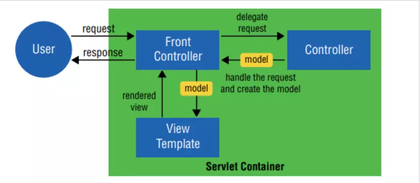
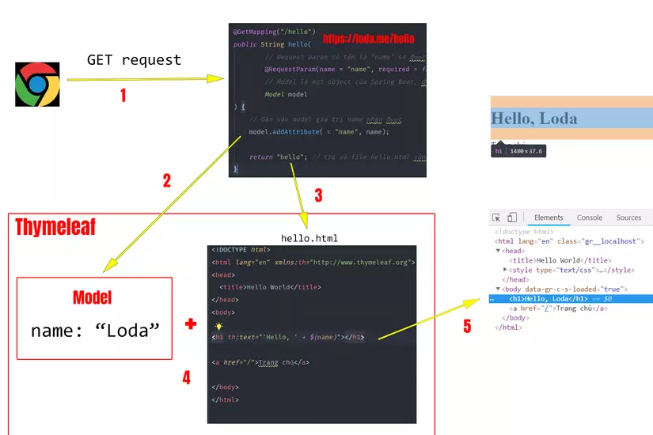
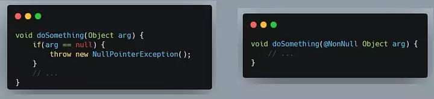
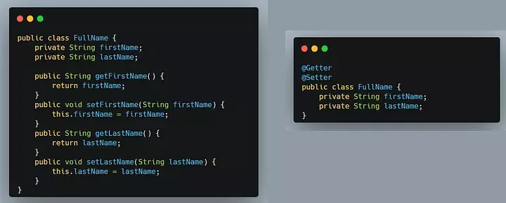
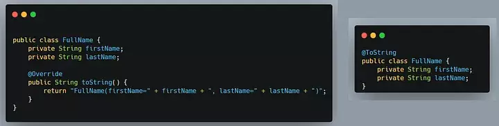

# BUỔI 6: SPRING MVC

## I. Bean trong SpringBoot: Bean là gì, BeanFactory là gì, vòng đời của 1 Bean ở trong SpringBoot.

### 1. Bean là gì?

Trong mô hình của Spring Framework, Bean là các đối tượng mà IoC Container quản lý. Chúng là những thành phần cốt lõi được sử dụng để xây dựng ứng dụng. Bất kỳ đối tượng nào được khởi tạo, lắp ráp và quản lý bởi Spring IoC Container đều được gọi là Bean. Container này xử lý việc tạo ra và quản lý các Bean, bao gồm cả vòng đời của chúng từ khởi tạo đến hủy bỏ.

#### Các cách tạo Bean:

##### Sử dụng các Annotation Đánh Dấu Lên Class.

Khi bạn muốn Spring tự động nhận biết và quản lý một Bean, bạn có thể sử dụng các annotation như: ```@Component```, ```@Service```, ```@Repository``` và ```@Controller```.

- ```@Component```: Đây là cách chung nhất để đánh dấu một Bean. Nó cho biết đây là một đối tượng của ứng dụng mà bạn muốn Spring quản lý.

- ```@Service```: Dùng cho các lớp thực hiện xử lý logic nghiệp vụ.

- ```@Repository```: Sử dụng cho các lớp làm việc trực tiếp với cơ sở dữ liệu.

- ```@Controller```: Đặc biệt dành cho các lớp xử lý các yêu cầu HTTP, đóng vai trò như một cầu nối giữa người dùng và ứng dụng của bạn.

**_Ví dụ:_**
```java
@Service
public class BookService {
    // Logic nghiệp vụ để quản lý sách
}
```

##### Sử dụng @Bean Đánh Dấu Lên Method.

Phương pháp thứ hai là định nghĩa Bean trong một lớp Java với annotation ```@Configuration```. Đây là cách tạo Bean một cách rõ ràng hơn, thường được sử dụng khi ta cần cấu hình chi tiết hơn hoặc tạo Bean theo điều kiện đặc biệt.

Trong lớp ```@Configuration```, ta sẽ định nghĩa các phương thức trả về đối tượng của Bean, và mỗi phương thức này được đánh dấu bằng ```@Bean```. Điều này cho Spring biết rằng mỗi đối tượng trả về từ phương thức là một Bean và nên được quản lý bởi IoC Container.

**_Ví dụ:_**

```java
@Configuration
public class AppConfig {
    @Bean
    public BookService bookService() {
        return new BookService();
    }
}
```

Trong ví dụ này, bookService là một Bean được tạo ra và quản lý bởi Spring. Khi ứng dụng của bạn chạy, Spring sẽ tìm trong các lớp ```@Configuration``` để tạo và cấu hình các Bean theo định nghĩa.

#### Sử dụng Bean.

##### Field-based Injection

Field-based injection là phương thức tiêm phụ thuộc vào trường của một lớp. Spring sẽ tự động điền các giá trị phù hợp vào các trường được đánh dấu bằng ```@Autowired```. Đây là phương pháp đơn giản nhất nhưng không được khuyến khích vì nó làm giảm tính mô-đun và khó kiểm soát các phụ thuộc.

**_Ví dụ:_**

```java
@Component
public class ProductService {
    @Autowired
    private ProductRepository productRepository;
    // class details
}
```

Trong ví dụ trên, ProductService cần truy cập ProductRepository. Spring sẽ tự động tìm bean phù hợp và tiêm vào trường productRepository.

##### Constructor-based Injection

Constructor-based injection là phương thức tiêm phụ thuộc được khuyến khích nhất. Nó yêu cầu cung cấp các phụ thuộc của lớp thông qua hàm tạo. Điều này giúp rõ ràng các phụ thuộc của lớp và lớp không thể được tạo nếu thiếu bất kỳ phụ thuộc nào.

**_Ví dụ:_**

```java
@Component
public class OrderService {
    private final CustomerService customerService;

    @Autowired
    public OrderService(CustomerService customerService) {
        this.customerService = customerService;
    }
    // additional methods
}
```

Ở đây, OrderService phụ thuộc vào CustomerService. Spring sẽ tạo ra OrderService chỉ khi CustomerService đã sẵn sàng và được tiêm vào qua constructor.

##### Setter-based Injection

Setter-based injection cho phép ta tiêm phụ thuộc thông qua setter thay vì hàm tạo. Điều này có thể hữu ích khi bạn cần phụ thuộc không bắt buộc hoặc có thể thay đổi sau khi đối tượng đã được tạo.

**_Ví dụ:_**

```java
@Component
public class InventoryService {
    private ItemRepository itemRepository;

    @Autowired
    public void setItemRepository(ItemRepository itemRepository) {
        this.itemRepository = itemRepository;
    }
    // additional methods
}
```

Trong ví dụ này, InventoryService nhận ItemRepository thông qua setter. Phương thức setter này được gọi sau khi InventoryService được tạo, cho phép cập nhật hoặc thay đổi itemRepository sau này.

### 2. BeanFactory là gì?

BeanFactory Interface cung cấp cho chúng ta các cách để quản lý các đối tượng trong Spring IOC Container.

BeanFactory quản lí bean, tạo bean khi client cần.

Nó cũng đại loại như ApplicationContext, đại diện cho Spring IoC container nhưng ở mức cơ bản. ApplicationContext thì ở mức cao hơn, cung cấp nhiều tính năng hơn BeanFactory như i18n, resolving messages, publishing events,…

#### ApplicationContext là gì?

ApplicationContext là khái niệm Spring Boot dùng để chỉ Spring IoC container, tương tự như bean là đại diện cho các dependency.

Khi ứng dụng Spring chạy, Spring IoC container sẽ quét toàn bộ packages, tìm ra các bean và đưa vào ApplicationContext. Cơ chế đó là Component scan.

https://viblo.asia/p/spring-boot-in-action-essential-concepts-for-source-code-analysis-PAoJexkK41j

### 3. Vòng đời của 1 Bean trong Spring Boot.

#### Annotation ```@PostConstruct``` trong Spring Boot

```@PostConstruct``` là một Annotation đánh dấu trên một method bên trong một Bean. IoC Container hoặc ApplicationContext sẽ gọi method này sau khi Bean đó được tạo ra và quản lý.

**_Ví dụ:_**

```java
@Component
public class Girl {

    @PostConstruct
    public void postConstruct(){
        System.out.println("\t>> Đối tượng Girl sau khi khởi tạo xong sẽ chạy hàm này");
    }
}
```

#### Annotation ```@PreDestroy``` trong Spring Boot

```@PreDestroy``` là một Annotation đánh dấu trên một method bên trong một Bean. IoC Container hoặc ApplicationContext sẽ gọi method này trước khi Bean đó bị xóa hoặc không được quản lý nữa.

**_Ví dụ:_**

```java
@Component
public class Girl {

    @PreDestroy
    public void preDestroy(){
        System.out.println("\t>> Đối tượng Girl trước khi bị destroy thì chạy hàm này");
    }
}
```

#### Vòng đời của Bean

Vòng đời (life cycle) của bean được hiểu là từ khi bean được tạo ra cho tới khi chết đi, sẽ có những sự kiện (event) khác nhau xảy ra. Về vòng đời của bean có thể mô tả bởi sơ đồ sau:


##### Tóm tắt vòng đời của Bean:

- Khi IoC Container tìm thấy một Bean cần quản lý, nó sẽ khởi tạo bằng Constructor.

- Dependencies sẽ được inject vào Bean thông qua Setter và thực hiện các quá trình cài đặt khác.

- Hàm được đánh dấu ```@PostConstruct``` sẽ được gọi.

- Bean đã sẵn sàng để hoạt động.

- Nếu IoC Container không quản lý Bean nữa hoặc bị shutdown, hàm ```@PreDestroy``` sẽ được gọi.

- Bean được xóa.

## II. String MVC : @Controller, Thymeleaf.

Spring MVC là framework được thiết kế dành cho xây dựng ứng dụng nền tảng web. Nó tuân theo mô hình MVC (Model-View-Controller)

- **Model:** là các file POJO, Service, DAO thực hiện truy cập database, xử lý business.

- **View:** là các file JSP, html…

- **Control:** là Dispatcher Controller, Handler Mapping, Controller – thực hiện điều hướng các request.

### Flow trong Spring MVC.



- Bất kỳ request nào tới ứng dụng web đều sẽ được gửi tới Front Controller (Dispatcher Servlet)

- Front Controller sẽ sử dụng Handler Mapping để biết được controller nào sẽ xử lý request đó

- Controller nhận request, gọi tới các class service thích hợp để xử lý yêu cầu.

- Sau khi xử lý xong, Controller sẽ nhận được model từ tầng Service hoặc tầng DAO.

- Controller gửi model vừa nhận được tới Front Controller (Dispatcher Servlet)

- Dispatcher Servlet sẽ tìm các mẫu view, sử dụng view resolver và truyền model vào nó.

- View template, model, view page được build và gửi trả lại Front Controller

- Front Controller gửi một page view tới trình duyệt để hiển thị nó cho người dùng.

### 1. @Controller.

```@Controller``` là chú thích chính cho biết lớp được chú thích đóng vai trò là Bộ điều khiển của MVC. Dispatcher Servlet quét các lớp được chú thích với nó để ánh xạ các yêu cầu web tới các phương thức được chú thích bằng ```@RequestMapping```.

```@Controller``` kế thừa từ chú thích ```@Component``` giống như các chú thích Spring khác, chẳng hạn như ```@Service``` và ```@Repository```.

### 2. @RequestMapping.

```@RequestMapping``` để ánh xạ các yêu cầu tới các phương thức của bộ điều khiển. Nó có các thuộc tính khác nhau để khớp theo URL, phương thức HTTP, tham số yêu cầu, tiêu đề và loại phương tiện. Bạn có thể sử dụng nó ở cấp lớp để thể hiện các ánh xạ được chia sẻ hoặc ở cấp phương pháp để thu hẹp thành một ánh xạ điểm cuối cụ thể.

https://viblo.asia/p/mot-so-khai-niem-co-ban-ve-spring-mvc-6J3Zg0PWlmB

### 3. Thymeleaf.

##### Thymeleaf là gì?

Thymeleaf là một Java Template Engine. Có nhiệm vụ xử lý và generate ra các file HTML, XML, v.v..

Các file HMTL do Thymeleaf tạo ra là nhờ kết hợp dữ liệu và template + quy tắc để sinh ra một file HTML chứa đầy đủ thông tin.



Việc của ta là cung cấp dữ liệu và quy định template như nào, còn việc dùng các thông tin đó để render ra HTML sẽ do Thymeleaf giải quyết.

##### Cú pháp

Cú pháp của Thymeleaf sẽ là một attributes (Thuộc tính) của thẻ HTML và bắt đầu bằng chữ ```th:```.

Với cách tiếp cận này, ta sẽ chỉ cần sử dụng các thẻ HTML cơ bản đã biết mà không cần bổ sung thêm syntax hay thẻ mới như JSP truyền thống.

**Ví dụ:** Để truyền dữ liệu từ biến name trong Java vào một thẻ H1 của HTML.

```html
<h1 th:text="${name}"></h1>
```

Chúng ta viết thẻ H1 như bình thường, nhưng không chứa bất cứ text nào trong thẻ. Mà sử dụng cú pháp th:text="${name}" để Thymeleaf lấy thông tin từ biến name và đưa vào thẻ H1.

Kết quả khi render ra:

```html
// Giả sử String name = "loda"
<h1>Loda</h1>
```

thuộc tính th:text biến mất và giá trị biến name được đưa vào trong thẻ H1.

##### Model & View Trong Spring Boot

**Model** là đối tượng lưu giữ thông tin và được sử dụng bởi Template Engine để generate ra webpage. Có thể hiểu nó là Context của Thymeleaf

**Model** lưu giữ thông tin dưới dạng key-value.

Trong template thymeleaf, để lấy các thông tin trong Model, ta sẽ sử dụng ```Thymeleaf Standard Expression```.

- ```${...}```: Giá trị của một biến.

- ```*{...}```: Giá trị của một biến được chỉ định.

Ngoài ra, để lấy thông tin đặc biệt hơn:

- ```#{...}```: Lấy message.

- ```@{...}```: Lấy đường dẫn URL dựa theo context của server

##### Các loại Expression.

- **```${...}``` - Variables Expressions**

Trên Controller ta đưa vào một số giá trị:

```html
model.addAttribute("today", "Monday");
```

Lấy giá trị của biến today:

```html
<p>Today is: <span th:text="${today}"></span>.</p>
```

Đoạn expression trên tương đương với:

```html
ctx.getVariable("today");
```

- **```*{...}``` - Variables Expressions on selections**

Dấu * còn gọi là asterisk syntax. Chức năng của nó giống với ```${...}``` là lấy giá trị của một biến.

Điểm khác biệt là nó sẽ lấy ra giá trị của một biến cho trước bởi ```th:object```

```html
  <div th:object="${session.user}">
    <!-- th:object tồn tại trong phạm vi của thẻ div này -->

    <!-- Lấy ra tên của đối tượng session.user -->
    <p>Name: <span th:text="*{firstName}"></span>.</p> 
    <!-- Lấy ra lastName của đối tượng session.user -->
    <p>Surname: <span th:text="*{lastName}"></span>.</p>
  </div>
```

Còn ```${...}``` sẽ lấy ra giá trị cục bộ trong Context hay Model.

Vậy đoạn code ở trên tương đương với:

```html
<div>
  <p>Name: <span th:text="${session.user.firstName}"></span>.</p>
  <p>Surname: <span th:text="${session.user.lastName}"></span>.</p>
</div>
```

- **```#{...}``` - Message Expression**

Ví dụ, trong file config ```.properties``` của tôi có một message chào người dùng bằng nhiều ngôn ngữ.

```html
home.welcome=¡Bienvenido a nuestra tienda de comestibles!
```

Thì cách lấy nó ra nhanh nhất là:

```html
<p th:utext="#{home.welcome}">Xin chào các bạn!</p>
```

- **```@{...}``` - URL Expression**

```@{...}``` xử lý và trả ra giá trị URL theo context của máy chủ cho chúng ta.

Ví dụ:

```html
<!-- tương đương với 'http://localhost:8080/order/details?orderId=3' -->
<a href="details.html" 
   th:href="@{http://localhost:8080/order/details(orderId=${o.id})}">view</a>

<!-- tương đương  '/order/details?orderId=3' -->
<a href="details.html" th:href="@{/order/details(orderId=${o.id})}">view</a>

<!-- tương dương '/gtvg/order/3/details' -->
<a href="details.html" th:href="@{/order/{orderId}/details(orderId=${o.id})}">view</a>
```

Nếu bắt đầu bằng dấu ```/``` thì nó sẽ là Relative URL và sẽ tương ứng theo context của máy chủ của bạn.

## III. 1 số Annotation trong SpingBoot: @SpringBootApplication, @Component, @Bean, @Autowired

### 1. Annotation là gì?

Annotation là một dạng siêu dữ liệu để cung cấp thêm những thông tin bổ sung về chương trình. Nó không ảnh hưởng trực tiếp đến chương trình khi chạy nhưng chúng mang những thông tin quan trọng về cấu trúc và mục đích của đoạn mã nguồn. Annotation được gán cho Class, Method, Parameter, Variable và Package. Annotation không làm thay đổi các hành động trong quá trình biên dịch (Compile time).

### 2. @Autiowired.

```@Autowired```: Áp dụng cho setter, constructor, instance variable. Khi chúng ta gán @Autowired Spring container sẽ tự động tạo ra liên kết tương ứng vơi data-type.

```html
@RestController
@RequestMapping("/user")
public class UserController {

@Autowired
private UserService userService;
}
```

### 3. @Configuration.

```@Configuration```: Áp dụng cho Class, Khi Class được gán @Configuration cho Spring Boot biết chúng chứa thông tin cấu hình của ứng dụng.

```html
@Configuration
public class AppConfig {
...
}
```

### 4. @ComponentScan.

```@ComponentScan```: Nếu như bạn muốn chỉ định Spring Boot quét thông tin một package cho các bean thì có thể dùng kết hợp với @Configuration.

```html
@ComponentScan(basePackages = "vn.tayjava.model")
@Configuration
public class AppConfig {
...
}
```

### 5. @Bean.

```@Bean```: Áp dụng cho method nằm trong Class được gán @Configuration, Method được gán @Bean sẽ tạo ra một bean và được quản lý bởi Spring Container.

```html
@Configuration
public class AppConfig {

    @Bean
    public PasswordEncoder passwordEncoder() {
        return new BCryptPasswordEncoder();
    }
}
```

### 6. @Component.

```@Component```: Áp dụng cho Class, Class được gán @Component cho chúng ta biết bean được tạo ra và quản lý bởi Spring Boot.

```html
@Component
public class S3Client {

    @Autowired
    private AmazonS3 amazonS3Client;
    
    public void createS3Bucket(String bucketName, boolean publicBucket) {
    ....
    }
}
```

### 7. @Service.

```@Service```: Là annotation được sử dụng để chỉ rõ Class thuộc tầng business logic.

```html
@Service
@Slf4j(topic = "USER-SERVICE")
@RequiredArgsConstructor
public class UserService {

    private final UserRepository userRepository;
    private final SearchRepository searchRepository;

}
```

### 8. @Repository.

```@Repository```: Là annotation được sử dụng để chỉ rõ Class này thuộc tầng DAO, Class được áp dụng @Repository có thể truy cập trực tiếp vào database.

```html
@Repository
public interface UserRepository extends JpaRepository<UserEntity, Long>, JpaSpecificationExecutor {

    UserEntity findByUsername(String username);

    UserEntity findByEmail(String email);
}
```

https://www.iostream.co/article/tong-hop-spring-annotation-sV4rg

## IV. Lombok: @Getter, @Setter, @ToString, @Data, @Builder, @Constructior

Lombok là một thư viện Java giúp tự sinh ra các hàm setter/getter, hàm khởi tạo, toString… và tinh gọn chúng.

### 1. @NonNull

Bạn có thể sử dụng ```@NonNull``` trên các trường (field) hoặc tham số của phương thức hoặc constructor. Điều này sẽ khiến lombok tạo ra một kiểm tra null cho bạn.

Ngoài ra nếu bạn sử dụng nó để chú thích trên một trường. việc kiểm tra sẽ được thêm vào constructor và setter method



### 2. @Getter & @Setter

Có lẽ đây là 2 trong số những annotations phổ biến nhất của Lombok, được sử dụng để tự động tạo getters và setters cho tất cả các trường



### 3. @ToString



https://viblo.asia/p/16-lombok-annotations-trong-4-phut-EbNVQ5kAVvR

## V. Log trong SpringBoot : Log4j là gì và Antotation @Slf4j

https://gpcoder.com/5500-gioi-thieu-java-logging/