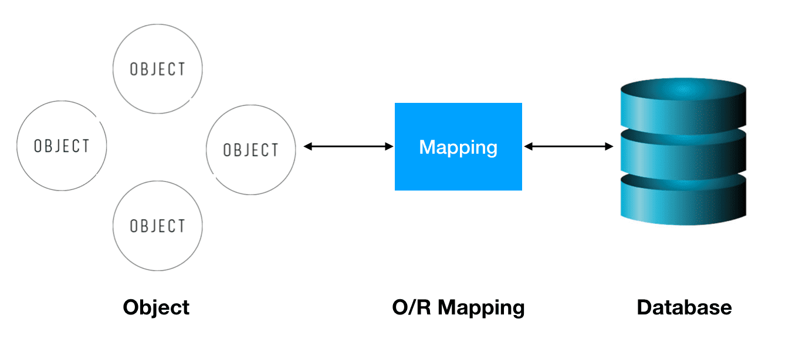
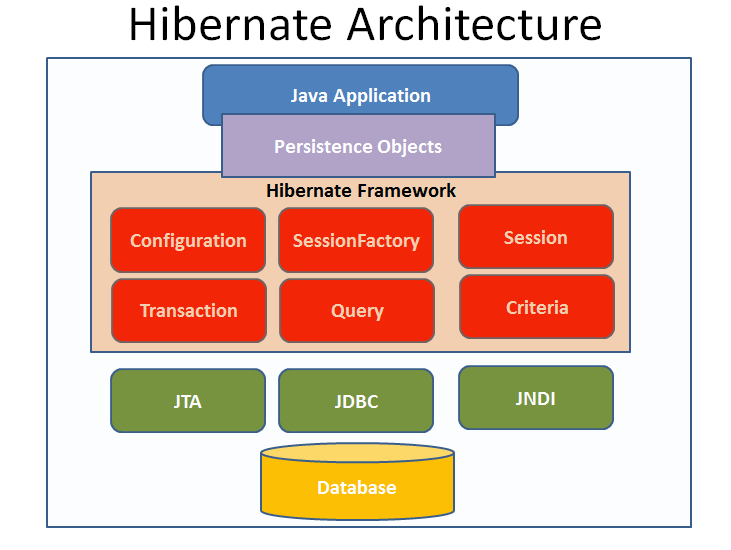

# BUỔI 7: CURD CƠ BẢN

## I. Triển khai RestfullAPI trong Spring Boot

## II. JPA là gì? Hibernate là gì?

### 1. JPA là gì?

JPA (Java Persistence API) là một đặc tả Java cho việc ánh xạ các đối tượng Java với CSDL quan hệ sử dụng công nghệ phổ biến là ORM (Object Relational Mapping)

JPA cung cấp đầy đủ các công cụ cho phép chúng ta có thể thao tác với CSDL một cách đơn giản và nhanh chóng. JPA giải quyết các vấn đề trong quản lý quan hệ giữa các thực thể, giúp chúng ta map những object Java (POJO – Plain Old Java OBject) thành những bảng trong database, đây là persistence frameworks được sử dụng nhiều nhất trong Java

JPA hoạt động như một cầu nối giữa các table/các mối quan hệ giữa các table trong database và các class/mối quan hệ giữa các object.

Ví dụ: bảng users với các cột (id, username, password) sẽ tương ứng với class User.java có các thuộc tính id, username, password.

#### 1.1. ORM là gì?



ORM (Object Relational Mapping) là một kỹ thuật/cơ chế lập trình thực hiện ánh xạ CSDL sang các đối tượng trong các ngôn ngữ lập trình hướng đối tượng.

Việc sử dụng ORM cho phép lập trình viên thao tác với database một cách tự nhiên, dễ hiểu thông qua các đối tượng.

##### 1.1.1. Ưu điểm của ORM

- OOP: ORM giúp lập trình viên tập trung vào lập trình hướng đối tượng

- Tính độc lập: Làm việc được với nhiều loại database, nhiều kiểu dữ liệu khác nhau. Dễ dàng thay đổi loại database hơn. Các câu lệnh SQL không cần phụ thuộc vào loại database

- Đơn giản, dễ sử dụng: Hỗ trợ HSQL, cung cấp nhiều API truy vấn.

- Năng suất hơn: Viết code ít hơn, dễ hiểu hơn. Phù hợp với các case CRUD (Create, Read, Update, Delete)

- Tái sử dụng code

##### 1.1.2. Nhược điểm

- Khả năng truy vấn bị hạn chế, nhiều trường hợp ta vẫn phải sử dụng native SQL để truy vấn database

- Khó tối ưu câu lệnh SQL (do câu lệnh SQL được ORM tự động sinh ra)

#### 1.2. Một số ORM framework

JPA chỉ là một API định nghĩa các đặc tả cần thiết và không có code hiện thực từ những đặc tả đó. Nó chỉ chứa những hướng dẫn để hiện thực ORM. Do đó cần phải có một cài đặt ORM để hoạt động và persist các đối tượng Java. Các ORM Framework có thể sử dụng cho JPA như: Hibernate, TopLink, ORMLite, iBatis, JPOX… Trong đó hibernate được sử dụng phổ biến hơn cả

#### 1.3. Kiến trúc JPA

JPA sử dụng metadata để ánh xạ các đối tượng persistence với các bảng trong cơ sở dữ liệu. JPA hỗ trợ SQL như là một ngôn ngữ truy vấn để dễ dàng xử lý các truy vấn cơ sở dữ liệu. Ngôn ngữ truy vấn JPA có thể dùng thực thi cả truy vấn tĩnh và truy vấn động. Các thành phần chính trong kiến trúc JPA:

##### 1.3.1. Enity

Trong JPA, một Entity là một đối tượng Java ánh xạ vào một bảng trong cơ sở dữ liệu. Chúng ta có thể hiệu là mối quan hệ 1-1. Đối tượng Entity chứa thông tin về cấu trúc và dữ liệu của bảng.

Để định nghĩa một Entity trong JPA, chúng ta có thể sử dụng các annotation như @Entity, @Table, @Column, vv. Dưới đây là một ví dụ:

```java
@Entity
@Table(name = "employees")
public class Employee {
    @Id
    @GeneratedValue(strategy = GenerationType.IDENTITY)
    private Long id;
    
    @Column(name = "name")
    private String name;
    
    // getters and setters
}
```

Ở ví dụ trên, Employee được đánh dấu là một Entity bằng cách sử dụng annotation @Entity. Sẽ ánh xạ vào bảng "employees" trong cơ sở dữ liệu. Thuộc tính id được đánh dấu là khóa chính bằng cách sử dụng annotation @Id. Các thuộc tính khác được ánh xạ vào các cột của bảng bằng cách sử dụng annotation @Column.

##### 1.3.2. EntityManager

Entity Manager là một thành phần quan trọng trong JPA. Nó làm nhiệm vụ quản lý các đối tượng Entity và từ đó chúng ta có thể sử dụng Entity Manager để thực hiện các hoạt động CRUD (Create, Read, Update, Delete) trên cơ sở dữ liệu. Ví dụ:

```java
public void createEmployee(Employee employee) {
    EntityManager entityManager = // lấy Entity Manager từ EntityManagerFactory
    
    entityManager.persist(employee); // thêm đối tượng vào cơ sở dữ liệu
}
```

Và ở ví dụ trên, chúng ta sử dụng phương thức persist() của Entity Manager để thêm một đối tượng Employee vào cơ sở dữ liệu.

##### 1.3.3. EntityTransaction

Trong JPA, mỗi hoạt động liên quan đến cơ sở dữ liệu sẽ được thực hiện trong một transaction. Transaction là một tập hợp các hoạt động ghi và đọc dữ liệu liên quan mà thường được thực hiện cùng nhau và được xem như là một thao tác duy nhất. Việc sử dụng các thao tác liên quan trong cùng một Transaction sẽ giúp đảm bảo tính toàn vẹn của dữ liệu khi thực hiện.

Để làm việc với transaction trong JPA, chúng ta sử dụng Entity Transaction. Dưới đây là một ví dụ:

```java
public void updateEmployeeName(long id, String newName) {
    EntityManager entityManager = // lấy Entity Manager từ EntityManagerFactory
    
    EntityTransaction transaction = entityManager.getTransaction();
    transaction.begin(); // bắt đầu transaction
    
    Employee employee = entityManager.find(Employee.class, id); // tìm kiếm đối tượng Employee theo id
    employee.setName(newName); // thay đổi tên của Employee
    
    transaction.commit(); // kết thúc transaction và lưu các thay đổi vào cơ sở dữ liệu
}
```

Trong ví dụ trên, chúng ta sử dụng phương thức getTransaction() của Entity Manager để lấy Entity Transaction. Sau đó, chúng ta bắt đầu transaction bằng cách gọi begin(). Trong một transaction, chúng ta có thể thực hiện các hoạt động liên quan đến cơ sở dữ liệu và cuối cùng gọi  phương thức commit() để kết thúc transaction và lưu các thay đổi vào cơ sở dữ liệu.

##### 1.3.4. Persistence Context

Là một vùng nhớ được quản lý bởi JPA, nơi chứa các entity đang được quản lý. Các thay đổi đối với entity trong persistence context sẽ được đồng bộ hóa với cơ sở dữ liệu khi thực hiện các giao dịch.

##### 1.3.5. Persistence Unit

Là một cấu hình xác định cách JPA kết nối với cơ sở dữ liệu, bao gồm thông tin về driver, URL kết nối, username, password,...

##### 1.3.6. EntityManagerFactory

EntityManagerFactory được dùng để tạo ra một instance của EntityManager.


### 2. Hibernate là gì?

Hibernate là 1 ORM (Object Relational Mapping) framework cho phép người lập trình thao tác với database một cách hoàn toàn tự nhiên thông qua các đối tượng. Lập trình viên java hoàn toàn không cần quan tâm đến loại database sử dụng, SQL…

Hay nói cách khác, Hibernate chính là cài đặt của JPA (JPA là 1 tập các interface, còn Hibernate implements các interface ấy 1 cách chi tiết).

#### 2.1. Kiến trúc Hibernate



##### 2.1.1. Persistence object

Chính là các POJO object map với các table tương ứng của cơ sở dữ liệu quan hệ. 

##### 2.1.2. Configuration

Là đối tượng đầu tiên và duy nhất bạn cần tạo trong một chương trình có sử dụng Hibernate. Nó đại diện cho thông tin cấu hình hoặc thuộc tính yêu cầu của Hibernate. Đối tượng này sẽ cung cấp cho chúng ta hai thành phần chính:

- Database Connection: Thao tác này được xử lý thông qua một hoặc nhiều tệp cấu hình được Hibernate hỗ trợ. Các tệp này là hibernate.properties và hibernate.cfg.xml.

- Class mapping: Tạo ra kết nối giữa các lớp Java và các bảng trong cơ sở dữ liệu

##### 2.1.3. Session Factory

Là một interface giúp tạo ra session kết nối đến database bằng cách đọc các cấu hình trong Hibernate configuration.

SessionFactory là đối tượng nặng (heavy weight object) nên thường nó được tạo ra trong quá trình khởi động ứng dụng và lưu giữ để sử dụng sau này.

SessionFactory là một đối tượng luồng an toàn (Thread-safe) và được sử dụng bởi tất cả các luồng của một ứng dụng.

Mỗi một database phải có một SessionFactory. Vì vậy, nếu bạn đang sử dụng nhiều cơ sở dữ liệu thì bạn sẽ phải tạo nhiều đối tượng SessionFactory. Giả sử ta sử dụng MySQL và Oracle cho ứng dụng Java của mình thì ta cần có một SessionFactory cho MySQL, và một SessionFactory cho Oracle.

##### 2.1.4. Hibernate Session

Một session được sử dụng để có được một kết nối vật lý với một cơ sở dữ liệu. Đối tượng Session là nhẹ và được thiết kế để được tạo ra instance mỗi khi tương tác với cơ sở dữ liệu. Các đối tượng liên tục được lưu và truy xuất thông qua một đối tượng Session.

Các đối tượng Session không nên được mở trong một thời gian dài bởi vì chúng thường không phải là luồng an toàn (thread-unsafe) và chúng cần được tạo ra và được đóng khi cần thiết.

Mỗi một đối tượng Session được SessionFactory tạo ra sẽ tạo một kết nối đến database.

##### 2.1.5. Transaction

Một Transaction đại diện cho một đơn vị làm việc với cơ sở dữ liệu và hầu hết các RDBMS hỗ trợ chức năng transaction. Các transaction trong Hibernate được xử lý bởi trình quản lý transaction (từ JDBC hoặc JTA).

Transaction đảm bảo tính toàn vẹn của phiên làm việc với cơ sở dữ liệu. Tức là nếu có một lỗi xảy ra trong transaction thì tất cả các tác vụ thực hiện sẽ thất bại.

Transaction là một đối tượng tùy chọn và các ứng dụng Hibernate có thể chọn không sử dụng interface này, thay vào đó quản lý transaction trong code ứng dụng riêng.

##### 2.1.6. Query

Các đối tượng Query sử dụng chuỗi truy vấn SQL (Native SQL) hoặc Hibernate Query Language (HQL) để lấy dữ liệu từ cơ sở dữ liệu và tạo các đối tượng.

##### 2.1.7. Criteria

Đối tượng Criteria được sử dụng để tạo và thực hiện các tiêu chí truy vấn để lấy các đối tượng từ database.

## III. Tìm hiểu các Annotation : @RestController, @Service, @Repository, @Entity, @Table, @Id, @Transactional, @Query ...

### 1. @RestController

@RestController là một annotation trong Spring Boot, đóng vai trò quan trọng trong việc xây dựng các dịch vụ web RESTful. Nó là sự kết hợp của hai annotation khác:

- @Controller: Đánh dấu một class là một controller, có nhiệm vụ xử lý các yêu cầu HTTP và trả về một response.

- @ResponseBody: Chỉ định rằng kết quả trả về của một phương thức trong controller sẽ được chuyển đổi trực tiếp thành body của response HTTP, thường là dưới dạng JSON hoặc XML.

Nói cách khác, @RestController cho phép bạn tạo các endpoint (điểm kết nối) để cung cấp dữ liệu dưới dạng RESTful API, mà không cần phải cấu hình thêm nhiều.

Khác với @Controller là sẽ trả về một template, @RestController trả về dữ liệu dưới dạng JSON.

**Ví dụ:**

```java
@RestController
@RequestMapping("/api/v1")
public class RestApiController{

    @GetMapping("/todo")
    public List<Todo> getTodoList() {
        return todoList;
    }
}

```

### 2. @Service

Đây là annotation đặc biệt của @Component. Được dùng để sử lý nghiệp vụ, logic.

**Ví dụ:**

```java
@Service
public class UserService {

    @Autowired
    UserRepository userRepository;

    @Autowired
    FacebookUtil facebookUtil;
}
```

### 3. @Repository

Đây cũng là một annotation đặc biệt của @Component. Được dùng để thao các với cơ sở dữ liệu.

Jpa sẽ cung cấp cho các hàm select, update,... cơ bản. Có thể áp dụng thêm Query Creation.

Các Interface thường gặp: CrudRepository, JpaRepository, MongoRepository,...

```java
@Repository
public interface UserRepository extends JpaRepository <User, Integer> {
    //Query Creation
}
```

### 4. @Entity

Mọi entity đề phải gắn @Entity. Hibernate sẽ dựa vào thôn tin này để mapping xuống một bảng trong database. Nếu @Entity không có tham số, tên của entity này trong database sẽ là tên của class. Nếu truyền tham số name vào thì sẽ custom được tên bảng.

**Ví dụ:**

```java
@Entity
public class Employee {

    private Long id;
    private String name;

    private String gender;

    // getter setter

}
```

### 5. @Id

Mỗi Entity đề phải có một id, id dùng để định danh, phân biệt giữa các bản ghi với nhau, đã là id thì nó phải unique. Id là được dùng để làm khóa chính của bảng.

**Ví dụ:**

```java
@Entity
public class Employee {

    @Id
    @GeneratedValue(strategy = GenerationType.IDENTITY)
    private Long id;
    private String name;
    private String gender;

    private String gender;

    // getter setter

}
```

Chúng ta có thể sinh giá trị cho khóa chính tự động bằng cách sử dụng @GeneratedValue với các GenerationType khác nhau. Có 4 GenerationType khác nhau chúng ta có thể chọn là, AUTO, TABLE, SEQUENCE, và IDENTITY.

Ví dụ trên dùng IDENTITY để sau khi một bản ghi được tạo ra thì id của nó sẽ tăng dần. Chúng ta không cần quan tâm đến giá trị của khoá chính mà database sẽ chịu trách nhiệm sinh ra giá trị này.

### 6. @Table

Mặc định tên table dưới database cũng sẽ giống với Entity class. Trong trường hợp tên table và tên entity không giống nhau, chúng ta có thể sử dụng @Table annotation để chỉ rõ table tương ứng với entity name.

**Ví dụ:**

```java
@Entity
@Table(name = "EMPLOYEE")
public class Employee {

    @Id
    @GeneratedValue(strategy = GenerationType.IDENTITY)
    private Long id;
    private String name;
    private String gender;

    private String gender;

    // getter setter

}
```


// JDBC
// servlet