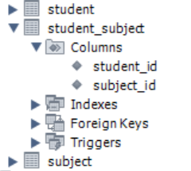
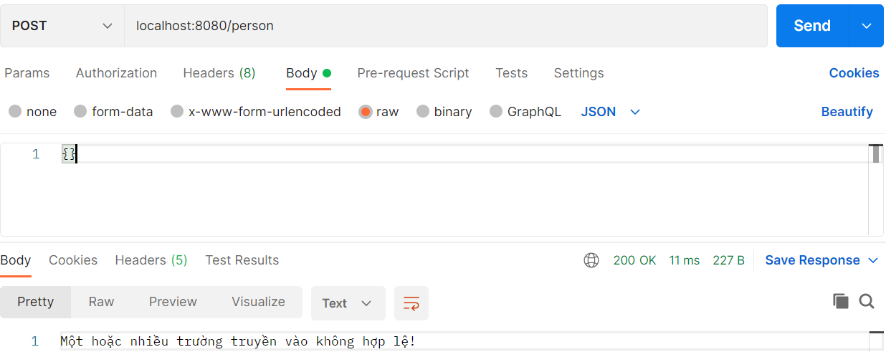
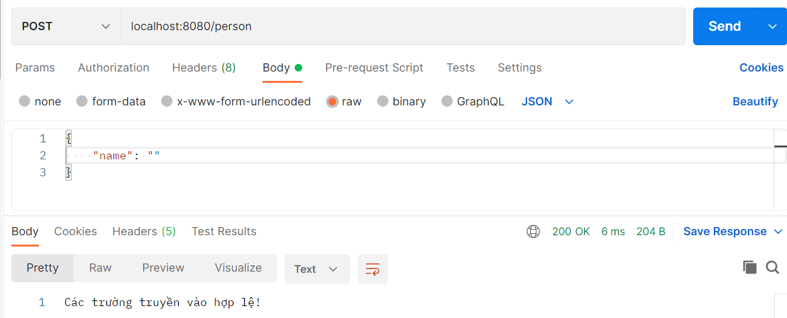

# BUỔI 8: CÁC QUAN HỆ TRONG JPA, JPA NATIVE QUERY, VALIDATION, HANDLING EXEPTION VÀ OPTIMIZE QUERY

## I. Các mối quan hệ(1..N, N..N) trong JPA (@ManyToMany, @OneToMany,...)

### 1. 1..N (@OneToMany)

#### Ví dụ: 

Tạo quan hệ 1..N giữa 1 bài đăng và các comment của bài đăng đó:

**Post**

```java
package com.example.demo.enity;

import jakarta.persistence.*;
import lombok.Getter;
import lombok.Setter;

import java.util.ArrayList;
import java.util.List;

@Getter
@Setter
@Entity
@Table(name = "post")
public class PostEnity {

    @Id
    @GeneratedValue(strategy = GenerationType.IDENTITY)
    private Long id;

    @Column(name = "title")
    private String title;

    @Column(name = "content")
    private String content;

    @OneToMany(mappedBy = "post")
    private List<CommentEnity> comments = new ArrayList<>();
}
```

Annotation ```@OneToMany``` được sử dụng để xác định thuộc tính trong lớp ```Comment``` sẽ được sử dụng để ánh xạ biến mappedBy. Đó là lý do tại sao chúng ta có 1 thuộc tính có tên là **“post”** trong lớp ```Comment```.

**Comment**

```java
package com.example.demo.enity;

import jakarta.persistence.*;
import lombok.Getter;
import lombok.Setter;

@Getter
@Setter
@Entity
@Table(name = "comment")
public class CommentEnity {

    @Id
    @GeneratedValue(strategy = GenerationType.IDENTITY)
    private Long id;

    @Column(name = "review")
    private String review;

    @Column(name = "commentername")
    private String commenterName;

    @ManyToOne
    @JoinColumn(name = "post_id")
    private PostEnity post;
}
```

Annotation ```@ManyToOne``` được liên kết với biến lớp ```Post```. Chú thích ```@JoinColumn``` tham chiếu đến cột được ánh xạ.
Sau khi thực hiện xong thì trong bảng ```Comment``` sẽ có thêm 1 cột là ```post_id```


### 2. N..N (@ManyToMany)

#### Ví dụ:

Tạo quan hệ N..N giữa student và subject:

**Student**

```java
package com.example.demo.enity;

import jakarta.persistence.*;
import lombok.Getter;
import lombok.Setter;

import java.util.ArrayList;
import java.util.List;

@Getter
@Setter
@Entity
@Table(name = "student")
public class StudentEnity {

    @Id
    @GeneratedValue(strategy = GenerationType.IDENTITY)
    private Long id;

    @Column(name = "name")
    private String name;

    @Column(name = "age")
    private Integer age;

    @Column(name = "gender")
    private String gender;

    @Column(name = "email")
    private String email;

    @ManyToMany
    @JoinTable(name = "student_subject",
            joinColumns = @JoinColumn(name = "student_id"),
            inverseJoinColumns = @JoinColumn(name = "subject_id"))
    private List<SubjectEnity> subjects = new ArrayList<>();
}
```

Để biểu thị mối quan hệ nhiều nhiều ta dùng annotation ```@ManyToMany```

Annotation ```@JoinTable``` sẽ chỉ rõ bảng trung gian trong thuộc tính ```name```, thuộc tính ```joinColumns``` sẽ chỉ rõ column mapping với table hiện tại, thuộc tính ```inverseJoinColumns``` sẽ chỉ rõ column mapping với table còn lại.

**Subject**

```java
package com.example.demo.enity;

import jakarta.persistence.*;
import lombok.Getter;
import lombok.Setter;

import java.util.ArrayList;
import java.util.List;

@Getter
@Setter
@Entity
@Table(name = "subject")
public class SubjectEnity {

    @Id
    @GeneratedValue(strategy = GenerationType.IDENTITY)
    private Long id;

    @Column(name = "name")
    private String name;

    @ManyToMany(mappedBy = "subjects")
    private List<StudentEnity> students = new ArrayList<>();
}
```
Sau khi thực hiện xong thì sẽ có bảng ```student_subject``` , trong bảng sẽ có 2 khóa ngoại là ```student_id``` và ```subject_id```



## II. Jpa native query

Spring Data JPA hỗ trợ chúng ta nhiều cách khác nhau để lấy dữ liệu từ cơ sở dữ liệu. Một số cách rất dễ sử dụng như derived queries, custom queries hay native queries. Trong đó native queries là cách linh hoạt và mạnh mẽ nhất giúp chúng ta đọc dữ liệu.

Native queries trong JPA cho phép chúng ta sử dụng tất cả các tính năng được hỗ trợ bởi cơ sở dữ liệu.

Với cách sử dụng ```@Query```, bạn sẽ có thể sử dụng câu truy vấn JPQL (Hibernate) hoặc raw SQL.

```java
public interface UserRepository extends JpaRepository<User, Long> {
    @Query(value = "select * from User u where u.email_address = ?1", nativeQuery = true)
    User myCustomQuery2(String emailAddress);
}
```

Cách truyền tham số là gọi theo thứ tự các tham số của method bên dưới ?1, ?2

Nếu bạn không thích sử dụng ?{number} thì có thể đặt tên cho tham số.

```java
public interface UserRepository extends JpaRepository<User, Long> {
    @Query(value = "SELECT * FROM Users u WHERE u.status = :status and u.name = :name", nativeQuery = true)
    User findUserByNamedParamsNative(@Param("status") Integer status, @Param("name") String name);
}
```

## III. Validation (@Valid, @NotNull, @Nullable, @Length, ...)

Spring Validation cung cấp cho chúng ta hàng loạt các annotation (chú thích) trong package javax.validation.constraints để hỗ trợ việc xác thực dữ liệu.

### 1. @NotNull, @NotEmpty và @NotBlank

Như tên gọi của nó, annotation ```@NotNull``` kiểm tra xem liệu thuộc tính có null hay không.

**Ví dụ:**

```java
@NotNull
private String name;
```

Nếu như trong request truyền vào không có trường name, hoặc giá trị truyền vào là null thì kết quả khi gọi vào endpoint để tạo Person bên trên thì kết quả trả về sẽ là lỗi:



Tuy nhiên nếu như tên được truyền vào là một String rỗng ("") thì kết quả lại như sau:



Vì vậy, ngoài ```@NotNull```, chúng ta còn có ```@NotEmpty``` và ```@NotBlank```:

- ```@NotNull```: có thể _dùng được cho hầu như tất cả các kiểu dữ liệu trong Java_, từ chối giá trị null hoặc không có nhưng chấp nhận giá trị rỗng. Note: Thậm chí annotation này có thể dùng được cho các kiểu dữ liệu nguyên thủy (int, long, float, double, char, byte...) mà không báo lỗi (mặc dù các kiểu nguyên thủy không thể null) nhưng mà nó sẽ không có tác dụng gì cả.

- ```@NotEmpty```: có thể dùng được cho CharSequence (interface của String, StringBuffer và StringBuilder), Collection, Map, Array. Annotation này từ chối cả giá trị null lẫn giá trị rỗng bằng cách kiểm tra độ dài (length) (String) hoặc kích thước (size) (Collection) xem có lớn hơn 0 hay không.

- ```@NotBlank```: có thể dùng được cho String. Annotation này từ chối String có giá trị null và String có độ dài là 0 sau khi đã trim (loại bỏ hết khoảng trắng thừa ở đầu và cuối của String)

### 2. @Valid

```java
@RestController
public class UserController {

    @PostMapping("/users")
    ResponseEntity<String> addUser(@Valid @RequestBody User user) {
        // persisting the user
        return ResponseEntity.ok("User is valid");
    }

    // standard constructors / other methods

}
```

Khi Spring Boot tìm một đối số annotation với ```@Valid```, nó tự động khởi động triển khai JSR 380 mặc định - Hibernate Validator - và xác thực đối số.

Khi đối số mục tiêu bị lỗi khi xác thực, Spring Boot sẽ ném ra exception **MethodArgumentNotValidException**.

### 3. @Nullable 

Trong Spring Boot, @Nullable là một annotation được sử dụng để chỉ ra rằng một biến, tham số, hoặc giá trị trả về có thể có giá trị null. Annotation này không bắt buộc phải sử dụng, nhưng nó rất hữu ích trong việc giúp lập trình viên và công cụ phát triển hiểu rõ hơn về cách mà các giá trị null có thể được sử dụng trong mã nguồn của bạn.

**Ví dụ:**

```java
public class User {
    @Nullable
    private String middleName;

    private String lastName;

    // Getters and Setters
}
```

### 4. @Length

Annotation @Length trong Spring Boot là một công cụ hữu ích để xác thực độ dài của các trường kiểu chuỗi trong đối tượng. Nó thuộc nhóm các annotation để xác thực dữ liệu, giúp đảm bảo tính toàn vẹn của dữ liệu đầu vào và ngăn chặn các lỗi không mong muốn.

Để sử dụng @Length, bạn cần thêm nó vào thuộc tính kiểu chuỗi mà bạn muốn giới hạn độ dài. Annotation này có hai thuộc tính chính:

- ```min```: Độ dài tối thiểu cho phép của chuỗi.

- ```max```: Độ dài tối đa cho phép của chuỗi.

Nếu giá trị của một trường không đáp ứng các điều kiện của annotation ```@Length```, một ngoại lệ sẽ được ném ra. Ngoại lệ này thường là ```MethodArgumentNotValidException``` và chứa thông tin về các lỗi xác thực.

**Ví dụ:**

```java
@Entity
public class User {
    @Id
    @GeneratedValue(strategy = GenerationType.IDENTITY)
    private Long id;

    @Size(min = 2, max = 50)
    private String firstName;   


    @Length(min = 2, max = 100)
    private String lastName;

    // ... các thuộc tính khác
}
```

https://techmaster.vn/posts/36877/xac-thuc-request-bang-spring-boot-validation

## IV. Xử lý ngoại lệ (@ControllerAdvice)

```@RestControllerAdvice``` là một Annotation được áp dụng trên một class và thường được sử dụng cùng với ```@ExceptionHandler```. Nó can thiệp vào việc xử lý của các ```@RestController```.

```@ControllerAdvice``` là một Annotation tương tự như ```@RestControllerAdvice```, nhưng thường được sử dụng cùng với ```@ExceptionHandler``` để can thiệp vào việc xử lý của các ```@Controller``` thông thường.

```@RestControllerAdvice``` và ```@ControllerAdvice``` thường được kết hợp với ```@ExceptionHandler``` để xử lý ngoại lệ.

```java
@RestControllerAdvice
public class ApiExceptionHandler {

    @ExceptionHandler(IndexOutOfBoundsException.class)
    @ResponseStatus(value = HttpStatus.BAD_REQUEST)
    public ErrorMessage todoException(Exception ex, WebRequest request) {
        return new ErrorMessage(10100, "Đối tượng không tồn tại");
    }
}
```

Trong ví dụ trên, chúng ta đã sử dụng ```@RestControllerAdvice``` và ```@ExceptionHandler``` để xử lý ngoại lệ ```IndexOutOfBoundsException```. Khi một ngoại lệ này xảy ra trong một ```Rest Controller```, Spring Boot sẽ gọi phương thức ```todoException``` và trả về một thông báo lỗi thân thiện hơn với HTTP status code là ```BAD_REQUEST```.

### @ResponseStatus

```@ResponseStatus``` cho phép bạn định nghĩa HTTP status code mà bạn muốn trả về cho người dùng. Bạn có thể sử dụng nó trên một đối tượng được trả về từ một phương thức. Nếu bạn không muốn sử dụng ```ResponseEntity```, bạn có thể sử dụng ```@ResponseStatus```.

## V. Tối ưu query khi sử dụng JPA (n+1 query,...)

Khi làm việc với JPA, việc tối ưu hiệu suất các truy vấn là vô cùng quan trọng, đặc biệt là để tránh vấn đề N+1 Query. Vấn đề này xảy ra khi một truy vấn ban đầu lấy ra một danh sách các đối tượng, sau đó mỗi đối tượng trong danh sách lại kích hoạt một truy vấn riêng để lấy thông tin liên quan, dẫn đến số lượng truy vấn tăng lên theo cấp số cộng.

**Ví dụ:**

```java
List<Author> authors = authorRepository.findAll();
for (Author author : authors) {
    List<Book> books = author.getBooks(); // Mỗi lần gọi sẽ tạo ra một truy vấn mới
}
```

Trong ví dụ trên, khi gọi ```findAll()``` để lấy danh sách các tác giả, sẽ có 1 truy vấn được thực thi. Tuy nhiên, khi duyệt qua danh sách tác giả và gọi ```getBooks()```, sẽ có thêm N truy vấn nữa được thực thi để lấy danh sách sách của từng tác giả, với N là số lượng tác giả.

### 1. FetchType.EAGER

Sử dụng ```FetchType.EAGER``` một cách ngầm định hoặc rõ ràng cho các liên kết JPA là một ý tưởng tồi vì ta sẽ tìm nạp nhiều dữ liệu hơn mà ta cần. Hơn nữa, chiến lược ```FetchType.EAGER``` cũng dễ gặp phải các vấn đề về truy vấn N+1.

Các liên kết @ManyToOne và @OneToOne sử dụng FetchType.EAGER theo mặc định.