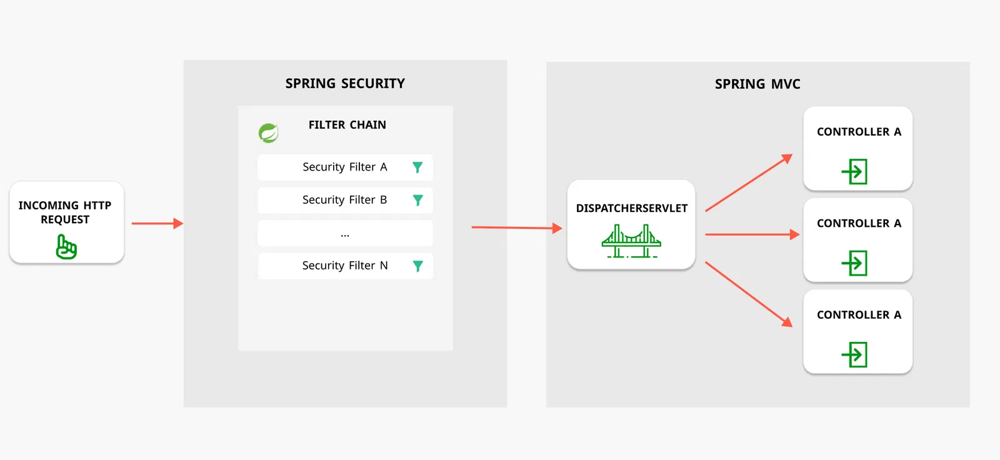
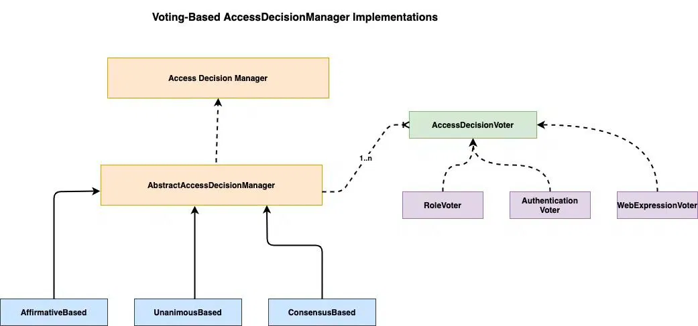
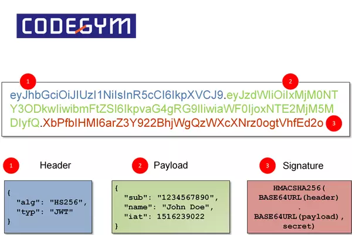

# BUỔI 9: SECURITY BASIC IMPLEMENT

## I. Spring security là gì?

Spring Security là một trong những tính năng cốt lõi của Spring Framework, nó cho phép bạn quản lý việc phân quyền và xác thực người dùng trước khi cho họ truy cập vào các tài nguyên của ứng dụng web.

Spring Security được thiết kế theo kiến trúc plugin, cho phép tùy biến linh hoạt và dễ dàng theo nhu cầu của ứng dụng và được tích hợp sẵn với các thành phần khác của Spring Framework, như Spring Boot, Spring MVC, Spring Data, Spring Cloud, và Spring WebFlux.

### 1. Cơ chế hoạt động của Spring Security.

Spring Security hoạt động theo mô hình client-server. Khi một client gửi một request đến server, server sẽ xác thực người dùng và phân quyền để đảm bảo rằng người dùng chỉ có thể truy cập vào những tài nguyên mà họ được phép truy cập.

Cơ chế hoạt động của Spring Security dựa trên cơ chế lọc (filter) và sự kiện (event) để can thiệp vào quá trình xử lý yêu cầu (request) và phản hồi (response) của ứng dụng web, tức là khi một yêu cầu được gửi đến ứng dụng web, nó sẽ được chuyển qua một chuỗi các bộ lọc (filter chain) do Spring Security quản lý. Mỗi bộ lọc có một nhiệm vụ cụ thể, như kiểm tra xác thực, kiểm tra phân quyền, điều hướng đến trang đăng nhập hoặc đăng xuất, xử lý các lỗi bảo mật.



Nếu một yêu cầu không thỏa mãn các điều kiện bảo mật của ứng dụng, Spring Security sẽ sinh ra một sự kiện (event) để thông báo cho ứng dụng biết. Ứng dụng có thể lắng nghe và xử lý các sự kiện này theo ý muốn, ví dụ như ghi log, gửi email hoặc hiển thị thông báo lỗi.

Ngược lại, nếu một yêu cầu được chấp nhận bởi Spring Security, nó sẽ được tiếp tục xử lý bởi ứng dụng web như bình thường. Khi ứng dụng web trả về một phản hồi cho yêu cầu, nó cũng sẽ được chuyển qua lại chuỗi các bộ lọc của Spring Security để áp dụng các thiết lập bảo mật cho phản hồi.

### 2. Các thành phần cơ bản của Spring Security.

#### a. Authentication.

Authentication là quá trình xác thực xem người dùng có quyền truy cập vào ứng dụng hay không. Khi người dùng đăng nhập vào hệ thống, thông tin đăng nhập của họ sẽ được xác thực để đảm bảo rằng họ là người dùng hợp lệ và có quyền truy cập vào các tài nguyên yêu cầu.

Authentication thường dựa trên các thông tin nhận dạng (identifier) và thông tin bí mật (credential) của người dùng hoặc ứng dụng, ví dụ như tên đăng nhập và mật khẩu, mã token, vân tay, khuôn mặt tùy theo cách tiếp cận của ứng dụng đó.

##### Spring Security hỗ trợ xác thực thông qua một số cơ chế, bao gồm:

- **Form-based authentication:** Xác thực thông qua một form đăng nhập.

- **HTTP Basic authentication:** Xác thực thông qua các header authorization.

- **Authentication via a custom login page:** Xác thực thông qua một trang đăng nhập tùy chỉnh.

- **Pre-authenticated authentication:** Xác thực thông qua các giá trị được cung cấp từ phía máy khách.

##### Trạng thái và phi trạng thái (Stateful vs Stateless)

- **Trạng thái (Stateful)** là một cách tiếp cận xác thực trong đó hệ thống sẽ lưu trữ thông tin xác thực của người dùng hoặc ứng dụng trong một phiên (session) trên máy chủ. Khi người dùng hoặc ứng dụng gửi một yêu cầu mới, hệ thống sẽ kiểm tra phiên hiện tại để xác định danh tính và quyền hạn của người dùng hoặc ứng dụng.

- **Phi trạng thái (Stateless)** là một cách tiếp cận khác với Stateful, khi đó hệ thống không lưu trữ thông tin xác thực của người dùng hoặc ứng dụng trên máy chủ, mà chỉ sử dụng các mã token đã được ký số để xác thực thông tin. Khi đó người dùng hoặc ứng dụng gửi một yêu cầu mới, hệ thống sẽ kiểm tra mã token để xác định danh tính và quyền hạn của người dùng hoặc ứng dụng.

#### b. Authorization.

Authorization là quá trình xác định quyền truy cập của người dùng đối với các tài nguyên trong ứng dụng. Khi người dùng truy cập vào một tài nguyên, Spring Security sẽ kiểm tra xem người dùng có được phép truy cập vào tài nguyên đó hay không hoặc thực hiện một hành động nào đó trong hệ thống.

Authorization thường dựa trên các thông tin về vai trò (role), nhóm (group), quyền hạn (permission), chính sách (policy). Ngoài ra, còn giúp đảm bảo rằng chỉ những người dùng hoặc ứng dụng có quyền thích hợp mới có thể truy cập vào tài nguyên hoặc thực hiện hành động được bảo vệ.

##### Phân quyền ứng dụng web với Spring Security.

- Spring Security hỗ trợ phân quyền ứng dụng web bằng cách sử dụng các annotation hoặc XML để định nghĩa các quyền truy cập cho người dùng. Các quyền truy cập này được áp dụng cho các tài nguyên trong ứng dụng, chẳng hạn như trang web hoặc API.

- Spring Security hỗ trợ phân quyền bằng cách sử dụng các thành phần sau:

    - **AccessDecisionManager:** là một interface định nghĩa phương thức ```decide()``` để kiểm tra quyền của người dùng hoặc ứng dụng khi truy cập vào một tài nguyên hoặc thực hiện một hành động nào đó. AccessDecisionManager có thể được cài đặt bởi các lớp con như AffirmativeBased, ConsensusBased, UnanimousBased,..

    - **AccessDecisionVoter:** là một interface định nghĩa phương thức vote() để đưa ra quyết định về quyền hạn của người dùng hoặc ứng dụng. AccessDecisionVoter cũng định nghĩa phương thức supports() để kiểm tra xem một loại tài nguyên hoặc hành động có được hỗ trợ hay không. AccessDecisionVoter có thể được cài đặt bởi các lớp con như RoleVoter, AuthenticatedVoter, WebExpressionVoter.

    
    
    - **SecurityExpressionHandler:** cũng là interface định nghĩa phương thức ```createSecurityExpressionRoot()``` để tạo ra một đối tượng SecurityExpressionRoot chứa các biểu thức bảo mật cho người dùng hoặc ứng dụng. SecurityExpressionHandler có thể được cài đặt bởi các lớp con như WebSecurityExpressionHandler, MethodSecurityExpressionHandler.

#### c. Authentication Provider.

Authentication Provider là một thành phần quan trọng trong Spring Security chịu trách nhiệm xác minh thông tin xác thực của người dùng hoặc ứng dụng. Ví dụ, khi một người dùng đăng nhập vào hệ thống, Authentication Provider sẽ kiểm tra thông tin đăng nhập của người dùng và trả về kết quả xác thực.

Authentication Provider được sử dụng bởi Authentication Manager để xử lý yêu cầu xác thực từ người dùng hoặc ứng dụng. Mỗi Authentication Provider chỉ hỗ trợ một loại Authentication cụ thể, ví dụ như UsernamePasswordAuthenticationToken, JwtAuthenticationToken, PreAuthenticatedAuthenticationToken,..

## II. JWT là gì?

**JWT - "JSON Web Token"** là một tiêu chuẩn mở cho việc tạo ra các token truy cập an toàn dựa trên JSON. JWT thường được sử dụng để xác thực và ủy quyền người dùng trong ứng dụng web và di động.

Các thành phần chính của JWT bao gồm: header, payload và signature. Header chứa thông tin về loại token và thuật toán ký, payload chứa các claims (tuyên bố) như thông tin người dùng và quyền hạn và signature được sử dụng để xác minh tính hợp lệ của token.

### 1. Các thành phần chính của JWT.

JWT gồm 3 thành phần chính: Header, Payload, Signature và chúng được ngăn cách với nhau bằng dấu “.”. Vì vậy, cấu trúc của JWT sẽ theo format sau: “header.payload.signature”.

#### a. Header.

Header chứa kiểu dữ liệu và các thuật toán giúp mã hóa ra chuỗi JWT một cách hoàn hảo. Header bao gồm 2 phần chính, đó là:

- **Typ (Type):** Đây là token và được mặc định là một JWT.

- **ALG (Algorithm):** Được dùng để mã hóa nhanh chóng (thuật toán chữ ký được sử dụng phổ biến như HMAC, SHA256, RSA).

#### b. Payload.

Payload đóng một vai trò rất quan trọng trong JWT, đây là nơi chứa các nội dung của thông tin (claim) mà người sử dụng muốn truyền đi ở bên trong chuỗi. Các thông tin này góp phần mô tả thực thể một cách đơn giản và nhanh chóng hoặc cũng có thể là các thông tin bổ sung thêm cho phần Header. 

#### c. Signature.

Signature là phần chữ ký bí mật và phần này được tạo ra bởi mã hóa phần Header cùng với phần Payload kết hợp với một chuỗi secret (khóa bí mật). Khi 3 phần này được kết hợp lại với nhau, chúng ta sẽ có một chuỗi JWT hoàn chỉnh nhất. Nhờ đó, JWT đảm bảo có thể trợ giúp hiệu quả cao cho công việc của một người lập trình viên.



https://viblo.asia/p/json-web-token-la-gi-aWj533go56m